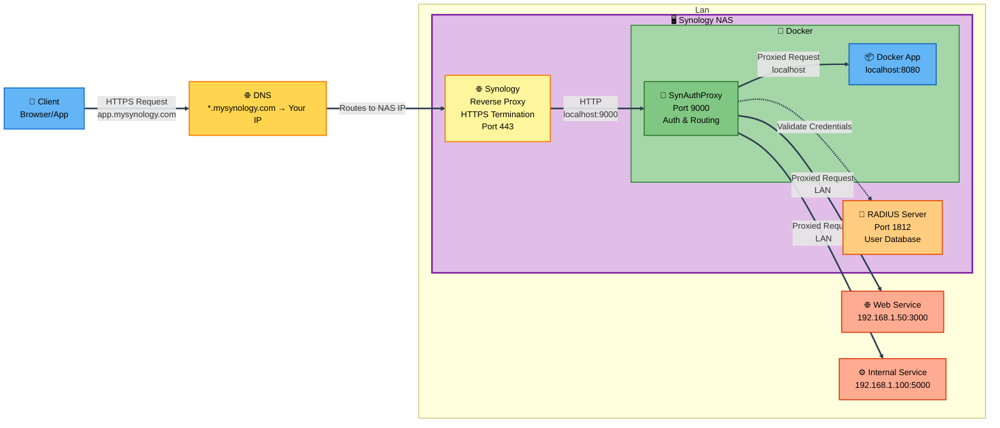

# 🔐 SynAuthProxy

> **Centralized authentication proxy for Synology NAS** - Secure your self-hosted apps with RADIUS authentication and elegant management UI

[](LICENSE)
[](https://www.python.org/downloads/)
[](https://fastapi.tiangolo.com/)

---

## 🎯 The Problem

You have multiple self-hosted applications (Docker containers, internal services, web apps) running on or near your Synology NAS. Each app has its own authentication system (or worse, none at all):

- ❌ **Fragmented Authentication** - Different passwords for each service
- ❌ **Security Gaps** - Some apps exposed without proper auth
- ❌ **User Management Nightmare** - Add/remove users in multiple places
- ❌ **No WebSocket Support** - Many reverse proxies don't handle WebSocket upgrades
- ❌ **Complex Configuration** - Managing routing rules across multiple services

## ✨ The Solution

**SynAuthProxy** sits between your Synology reverse proxy and your applications, providing:

- ✅ **Single Sign-On** - Use your existing Synology user accounts
- ✅ **Centralized Management** - One place to control all app routing
- ✅ **Beautiful Web UI** - Manage mappings with inline editing
- ✅ **WebSocket Ready** - Automatic HTTP → WebSocket upgrades
- ✅ **Path Manipulation** - Strip prefixes, rewrite URLs
- ✅ **Role-Based Access** - Admin controls for mapping management
- ✅ **Zero Application Changes** - Apps don't need auth code

---


---

## 🏗️ Architecture



### Request Flow

1. **Client** makes HTTPS request to `app.mysynology.com`
2. **DNS** resolves to your Synology NAS public IP
3. **Synology Reverse Proxy** (running on NAS) terminates SSL and forwards to SynAuthProxy container
4. **SynAuthProxy** (Docker container on NAS) checks authentication:
   - If not logged in → Show login page
   - Validate credentials via **RADIUS server** (running on NAS)
   - RADIUS verifies against Synology user database
5. **Route matching** - Find the right backend based on URL
6. **Path manipulation** - Strip prefixes if configured
7. **Proxy** - Forward to destination app (HTTP or WebSocket)

---

## 🚀 Quick Start

### Prerequisites

- Synology NAS with DSM 7.0+
- Docker and Docker Compose installed
- RADIUS Server package installed on Synology
- Domain name with DNS configured

### 1. Install RADIUS Server on Synology

```bash
# Via Package Center
1. Open Package Center
2. Search for "RADIUS Server"
3. Click Install
```

**Learn more:** [Synology RADIUS Server](https://www.synology.com/en-global/dsm/packages/RadiusServer)

Configure RADIUS:
- Open RADIUS Server app
- Enable on port `1812`
- Set shared secret (e.g., `your-secret-here`)
- Add client: `127.0.0.1` with the same secret

### 2. Deploy SynAuthProxy

```bash
git clone https://github.com/yourusername/synauthproxy.git
cd synauthproxy

# Edit docker-compose.yml with your settings
nano docker-compose.yml

# Start the service
docker-compose up -d
```

### 3. Configure Synology Reverse Proxy

Control Panel → Login Portal → Advanced → Reverse Proxy

Create rules for each subdomain:

| Source | Destination |
|--------|-------------|
| `https://app.mysynology.com:443` | `http://localhost:9000` |
| `https://api.mysynology.com:443` | `http://localhost:9000` |

✅ Enable WebSocket support in each rule!

### 4. Configure Mappings

Visit `https://yourdomain.com/mappings` and add your apps:

| Match URL | Destination | Flags |
|-----------|-------------|-------|
| `app.mysynology.com` | `http://localhost:8080` | - |
| `api.mysynology.com/v1` | `http://docker-api:3000` | `strip_path` |

---

## 📋 Configuration

### Environment Variables

### Environment Variables

| Variable | Required | Default | Description |
|----------|----------|---------|-------------|
| `RADIUS_SERVER` | ✅ Yes | - | RADIUS server IP/hostname (usually `127.0.0.1`) |
| `RADIUS_SECRET` | ✅ Yes | - | RADIUS shared secret |
| `RADIUS_PORT` | No | `1812` | RADIUS server port |
| `RADIUS_NAS_IDENTIFIER` | No | `synauthproxy` | NAS identifier sent to RADIUS |
| `LOGIN_DOMAIN` | No | - | Domain for login redirects |
| `SYNAUTHPROXY_ADMIN_USERS` | No | - | Comma-separated admin usernames (empty = all users are admins) |

### Docker Compose Example

```json
### Docker Compose Example

```yaml
services:
  synauthproxy:
    build:
      context: .
      dockerfile: Dockerfile
    restart: unless-stopped
    environment:
      RADIUS_SERVER: 127.0.0.1
      RADIUS_SECRET: your-secret-here
      RADIUS_PORT: 1812
      RADIUS_NAS_IDENTIFIER: synauthproxy
      LOGIN_DOMAIN: yourdomain.com
      # SYNAUTHPROXY_ADMIN_USERS: admin,igor  # Optional
    ports:
      - "9000:9000"
    volumes:
      - ./config:/app/config
      - /etc/localtime:/etc/localtime:ro
```

### Mappings Configuration

Edit `config/synauthproxy.json` or use the web UI at `https://yourdomain.com/mappings`:

```json
{
  "version": "1.0",
  "mappings": [
    {
      "match_url": "app.mysynology.com",
      "http_dest": "http://localhost:8080",
      "flags": []
    },
    {
      "match_url": "api.mysynology.com/v1",
      "http_dest": "http://docker-api:3000",
      "flags": ["strip_path"]
    }
  ]
}
```

**Available Flags:**
- `strip_path` - Remove the path portion before forwarding
- `disabled` - Temporarily disable this mapping

---

## 🎨 Features

### 📍 Smart URL Matching

| Pattern | Matches | Example |
|---------|---------|---------|
| `app.mysynology.com` | All paths on subdomain | `app.mysynology.com/any/path` |
| `mysynology.com/app` | Paths starting with `/app` | `mysynology.com/app/users` |
| `api.mysynology.com/v1` | Combined | `api.mysynology.com/v1/data` |

### 🔄 Automatic WebSocket Upgrades

No special configuration needed! SynAuthProxy detects `Upgrade: websocket` headers and:
- ✅ Establishes WebSocket connection to backend
- ✅ Forwards handshake headers
- ✅ Proxies messages bidirectionally
- ✅ Handles text and binary frames

### ✂️ Path Stripping

Perfect for apps that expect to run at root:

```
Incoming:  https://api.mysynology.com/v1/users
Match:     api.mysynology.com/v1  (with strip_path flag)
Forward:   http://backend/users
```

### 👥 Admin Management

- **View Mappings** - All authenticated users can view
- **Edit Mappings** - Only admin users (set via `SYNAUTHPROXY_ADMIN_USERS`)
- **Web UI** - Inline editing, drag-to-reorder, enable/disable toggles

### 🎯 Management UI


**Features:**
- ✏️ Inline editing with auto-save
- 🔼🔽 Reorder mappings (priority matters!)
- ✅ Enable/disable mappings without deleting
- 🎨 Color-coded changes
- 📱 Responsive design

---

## 📖 Usage Guide

### Adding a New App

1. **Deploy your app** (Docker, local service, etc.)
2. **Open mappings UI** at `https://yourdomain.com/mappings`
3. **Add new mapping**:
   - Match URL: `myapp.domain.com`
   - Destination: `http://localhost:8080`
   - Flags: `[]` (or `["strip_path"]` if needed)
4. **Configure Synology reverse proxy** for the new subdomain
5. **Test** - Visit `https://myapp.domain.com`

### Path Stripping Example

**Scenario:** You have an API at `http://backend:3000` that expects routes at root (`/users`, `/posts`), but you want to mount it at `https://api.mysynology.com/v1`

**Configuration:**
```json
{
  "match_url": "api.mysynology.com/v1",
  "http_dest": "http://backend:3000",
  "flags": ["strip_path"]
}
```

**Result:**
- Request: `https://api.mysynology.com/v1/users`
- Forwarded to: `http://backend:3000/users` ✅

---

## 🔒 Security

### Built-in Security

- ✅ **HTTPS Termination** - Handled by Synology reverse proxy
- ✅ **Secure Cookies** - `HttpOnly` cookies (set `secure=True` in production)
- ✅ **RADIUS Authentication** - Industry-standard protocol
- ✅ **Session Management** - Configurable timeout (default 1 hour)
- ✅ **No Stored Passwords** - Validates against RADIUS only
- ✅ **Role-Based Access** - Admin authorization for sensitive operations

### Best Practices

1. **Use HTTPS** - Always terminate SSL at Synology reverse proxy
2. **Strong Secrets** - Use complex RADIUS shared secrets
3. **Limit Admin Access** - Set `SYNAUTHPROXY_ADMIN_USERS` to specific users
4. **Monitor Logs** - Check `/app/synauthproxy.log` for suspicious activity
5. **Keep Updated** - Regularly update Docker image and dependencies

---

## 🛠️ Troubleshooting

### Cannot Login

**Symptoms:** Login form shows "Invalid username or password"

**Solutions:**
- ✅ Verify RADIUS server is running: Synology → RADIUS Server
- ✅ Check shared secret matches in both places
- ✅ Ensure user exists in Synology (Control Panel → User & Group)
- ✅ Check logs: `docker logs synauthproxy`
- ✅ Verify RADIUS client IP is authorized (usually `127.0.0.1`)

### 404 - App Not Found

**Symptoms:** Error page after successful login

**Solutions:**
- ✅ Check mapping exists: `https://yourdomain.com/mappings`
- ✅ Verify `match_url` pattern matches your request URL
- ✅ Check mapping is not disabled
- ✅ Restart container: `docker-compose restart`

### WebSocket Connection Fails

**Symptoms:** WebSocket handshake errors

**Solutions:**
- ✅ Enable WebSocket in Synology reverse proxy settings
- ✅ Increase timeout settings (default may be too short)
- ✅ Check backend app supports WebSocket
- ✅ Verify no firewall blocking WebSocket traffic

### Reverse Proxy Not Working

**Symptoms:** Cannot access via domain, works with `localhost:9000`

**Solutions:**
- ✅ Verify reverse proxy rule in Synology points to port `9000`
- ✅ Check DNS resolves to your Synology IP
- ✅ Ensure Synology firewall allows incoming HTTPS
- ✅ Test with `curl http://localhost:9000/health` on Synology

---

## 🏗️ Development

### Project Structure

```
synauthproxy/
├── main.py                 # FastAPI application & routing logic
├── Dockerfile             # Container image definition
├── docker-compose.yml     # Service orchestration
├── pyproject.toml         # Python dependencies
├── Makefile              # Build & deploy commands
├── README.md             # This file
├── config/
│   └── synauthproxy.json  # Mappings configuration (auto-created)
└── templates/
    ├── login.html         # Authentication page
    └── mappings.html      # Management UI
```

### Local Development

```bash
# Install dependencies
pip install -e .

# Run locally (requires accessible RADIUS server)
uvicorn main:app --reload --port 9000 --host 0.0.0.0

# View logs
tail -f synauthproxy.log

# Run in Docker
docker-compose up --build
```

### Testing

```bash
# Health check
curl http://localhost:9000/health

# Test login (will redirect to login page)
curl -c cookies.txt http://localhost:9000/mappings

# Test with authentication
curl -b "auth=authenticated;username=testuser" http://localhost:9000/mappings
```

---

## 📊 Use Cases

### Personal Dashboard
Host your personal tools behind single sign-on:
- Grafana at `grafana.yourdomain.com`
- Nextcloud at `cloud.yourdomain.com`
- Home Assistant at `home.yourdomain.com`

### Development Environment
Secure your development services:
- GitLab at `git.yourdomain.com`
- Jenkins at `ci.yourdomain.com`
- SonarQube at `code.yourdomain.com`

### API Gateway
Consolidate multiple APIs:
- `api.yourdomain.com/v1` → User Service
- `api.yourdomain.com/v2` → Notification Service
- `api.yourdomain.com/admin` → Admin Portal

---

## 🤝 Contributing

Contributions are welcome! Please:

1. Fork the repository
2. Create a feature branch (`git checkout -b feature/amazing-feature`)
3. Commit changes (`git commit -m 'Add amazing feature'`)
4. Push to branch (`git push origin feature/amazing-feature`)
5. Open a Pull Request

---

## 📄 License

This project is licensed under the MIT License - see the [LICENSE](LICENSE) file for details.

---

## 🙏 Acknowledgments

- **FastAPI** - Modern, fast web framework
- **pyrad** - RADIUS client implementation
- **Synology** - For the amazing NAS platform
- **Community** - For feedback and contributions

---

## 📞 Support

- 🐛 **Issues**: [GitHub Issues](https://github.com/yourusername/synauthproxy/issues)
- 💬 **Discussions**: [GitHub Discussions](https://github.com/yourusername/synauthproxy/discussions)
- 📧 **Email**: your.email@example.com

---

<div align="center">
  
**Made with ❤️ for the self-hosting community**

[⭐ Star this repo](https://github.com/yourusername/synauthproxy) • [🐛 Report Bug](https://github.com/yourusername/synauthproxy/issues) • [✨ Request Feature](https://github.com/yourusername/synauthproxy/issues)

</div>
```

#### Available Flags
- `strip_path` - Remove the path portion before forwarding (e.g., `/v1/users` → `/users`)
- `disabled` - Temporarily disable this mapping

## Features

### Dynamic URL Matching
- **Subdomain**: `app.domain.com` → Routes all paths
- **Path**: `domain.com/app` → Routes only `/app/*` paths
- **Combined**: `api.domain.com/v1` → Routes only `/v1/*` on subdomain

### WebSocket Support
Automatically detects and upgrades WebSocket connections:
- No separate configuration needed
- Forwards `Upgrade: websocket` headers
- Bidirectional message proxying

### Admin Management
- **All users**: Can view mappings (read-only)
- **Admin users**: Can add/edit/delete/reorder mappings
- Set via `SYNAUTHPROXY_ADMIN_USERS` environment variable

### Path Stripping
Useful when apps expect to be at root:
```
Request: api.domain.com/v1/users
Match:   api.domain.com/v1  (with strip_path flag)
Forward: http://backend/users  (path stripped)
```

## Usage

### Start the Service
```bash
docker-compose up -d
```

### Access Web UI
Navigate to `https://yourdomain.com/mappings` to:
- View all configured mappings
- Add new mappings (if admin)
- Edit inline with auto-save
- Reorder mappings (priority matters!)
- Enable/disable mappings

### Login
Users authenticate with their **Synology username and password**. The RADIUS server validates against Synology's user database.

## Development

### Project Structure
```
synauthproxy/
├── main.py                 # FastAPI application
├── Dockerfile             # Container definition
├── docker-compose.yml     # Service configuration
├── pyproject.toml         # Python dependencies
├── config/
│   └── synauthproxy.json  # Mappings configuration
└── templates/
    ├── login.html         # Login page
    └── mappings.html      # Mappings management UI
```

### Local Testing
```bash
# Install dependencies
pip install -e .

# Run locally (requires RADIUS server)
uvicorn main:app --reload --port 9000
```

## Environment Variables

| Variable | Required | Default | Description |
|----------|----------|---------|-------------|
| `RADIUS_SERVER` | Yes | - | RADIUS server IP/hostname |
| `RADIUS_SECRET` | Yes | - | RADIUS shared secret |
| `RADIUS_PORT` | No | 1812 | RADIUS server port |
| `RADIUS_NAS_IDENTIFIER` | No | synauthproxy | NAS identifier |
| `LOGIN_DOMAIN` | No | - | Domain for login redirects |
| `SYNAUTHPROXY_ADMIN_USERS` | No | - | Comma-separated admin usernames |

## Security Considerations

- ✅ **HTTPS Termination**: Handled by Synology reverse proxy
- ✅ **Secure Cookies**: HttpOnly cookies (set `secure=True` in production)
- ✅ **RADIUS Authentication**: Centralized user management
- ✅ **Admin Authorization**: Role-based access control
- ✅ **Session Management**: Cookie-based sessions with configurable timeout

## Troubleshooting

### Cannot Login
- Verify RADIUS server is running on Synology
- Check RADIUS shared secret matches in both places
- Ensure RADIUS client (SynAuthProxy IP) is authorized
- Check logs: `docker logs synauthproxy`

### Reverse Proxy Not Working
- Verify reverse proxy rule points to correct port (9000)
- Check Synology firewall allows localhost connections
- Ensure SynAuthProxy is running: `docker ps`

### WebSocket Connection Fails
- Verify reverse proxy has WebSocket support enabled
- Check timeout settings in reverse proxy
- Ensure backend app supports WebSocket

## License

MIT License - See LICENSE file for details

## Contributing

Contributions welcome! Please open an issue or submit a pull request.
