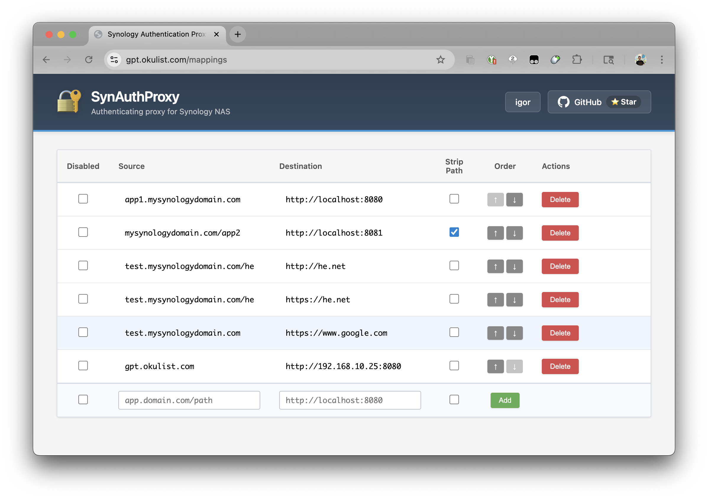
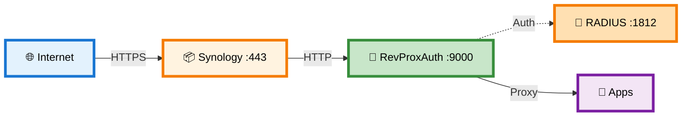
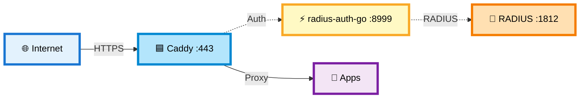
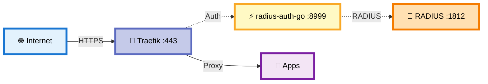
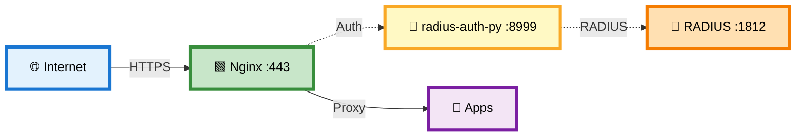

# 🔐 RevProxAuth and standalone RADIUS middleware

> **RADIUS authentication for reverse proxies** - Complete all-in-one solution + lightweight middleware for Caddy, Traefik, and Nginx

[](LICENSE)
[](https://www.python.org/downloads/)
[](https://fastapi.tiangolo.com/)
[](https://github.com/okigan/revproxauth/actions/workflows/lint.yml)
[](https://github.com/sponsors/okigan)

---

## 🎯 The Problem

You have self-hosted services that **lack authentication entirely**:

- ❌ **No built-in authentication** - Applications exposed without any login mechanism
- ❌ **Security gaps** - Internal tools, legacy apps, or services that trust the network
- ❌ **Can't modify the app** - Third-party services you can't add auth code to
- ❌ **Need centralized control** - Want RADIUS-based authentication without touching the app

Add **authentication to services that have none** by placing RADIUS-based auth in front of them using reverse proxies.

This repository provides **multiple RADIUS authentication solutions** for reverse proxy infrastructure:

1. **RevProxAuth (All-in-One)** - Complete reverse proxy with authentication and web UI
2. **radius-auth-go** - Lightweight Go middleware for Caddy/Traefik/Nginx
3. **radius-auth-py** - Lightweight Python middleware for Caddy/Traefik/Nginx

**Key Benefits:**
- ✅ **Add auth where none exists** - Protect unprotected services instantly
- ✅ **RADIUS Integration** - Use existing RADIUS servers (Synology, FreeRADIUS, etc.)
- ✅ **Zero Application Changes** - Apps don't need modification or auth code
- ✅ **Flexible Deployment** - Full proxy or lightweight auth middleware
- ✅ **WebSocket Support** - Automatic HTTP → WebSocket upgrades
- ✅ **Production Ready** - Docker images for AMD64 and ARM64

---



---

## 🏗️ What's in This Repository

This repository provides **RADIUS authentication components** for different reverse proxy architectures. All components are available as Docker images:

- **RevProxAuth** - All-in-one solution with routing, auth, and web UI with on the fly updates (one container does it all)
- **radius-auth-go** - Lightweight auth middleware (Go) supporting forward auth and auth_request protocols
- **radius-auth-py** - Lightweight auth middleware (Python) supporting forward auth and auth_request protocols
- **example-configs** - Example docker compose configs for RevProxAuth/Nginx/Caddy/Traefik

Choose the deployment that fits your infrastructure:

### 1️⃣ All-in-One: RevProxAuth (Synology-Optimized)

**Best for:** Synology NAS users who want a complete solution with web UI



**Features:**
- ✅ Complete solution with web UI for managing mappings
- ✅ Host-based routing (one wildcard proxy rule in Synology)
- ✅ Path manipulation (strip_path support)
- ✅ WebSocket automatic upgrade
- ✅ Works with Synology's RADIUS Server package

**Docker Image:** `okigan/revproxauth:latest`

---

### 2️⃣ Caddy + RADIUS Auth Middleware

**Best for:** Users who want automatic HTTPS with Caddy's simplicity



**Features:**
- ✅ Lightweight Go-based RADIUS auth middleware
- ✅ Minimal resource usage
- ✅ Forward auth protocol support
- ✅ Works with Caddy's automatic HTTPS

**Docker Images:** 
- `caddy:latest`
- `okigan/radius-auth-go:latest`

---

### 3️⃣ Traefik + RADIUS Auth Middleware

**Best for:** Dynamic container environments with service discovery



**Features:**
- ✅ Lightweight Go-based RADIUS auth middleware
- ✅ Forward auth protocol support
- ✅ Works with Traefik's dynamic service discovery
- ✅ Compatible with Docker/Kubernetes environments

**Docker Images:**
- `traefik:latest`
- `okigan/radius-auth-go:latest`

---

### 4️⃣ Nginx + RADIUS Auth Middleware

**Best for:** Production environments needing proven stability



**Features:**
- ✅ Python-based RADIUS auth middleware
- ✅ auth_request protocol support
- ✅ Works with Nginx's battle-tested stability
- ✅ Easy to customize and extend

**Docker Images:**
- `nginx:latest`
- `okigan/radius-auth-py:latest`

---

## 🎯 Which Deployment Should I Choose?

| Component | Reverse Proxy | Best For | Complexity | Language |
|-----------|---------------|----------|------------|----------|
| **RevProxAuth** | Built-in | Synology users, all-in-one solution | ⭐ Easy | Python |
| **radius-auth-go** | Caddy/Traefik/Nginx | Minimal footprint, fast startup | ⭐⭐ Medium | Go |
| **radius-auth-py** | Caddy/Traefik/Nginx | Easy customization, Python ecosystem | ⭐⭐ Medium | Python |

---

##  Docker Images

All components in this repository are published as multi-architecture Docker images (AMD64 + ARM64):

| Image | Component | Use Case |
|-------|-----------|----------|
| **`okigan/revproxauth:latest`** | RevProxAuth all-in-one | Complete solution with routing, auth, and web UI |
| **`okigan/radius-auth-go:latest`** | radius-auth-go | Lightweight Go middleware (forward auth & auth_request) |
| **`okigan/radius-auth-py:latest`** | radius-auth-py | Lightweight Python middleware (forward auth & auth_request) |

**Source code locations:**
- RevProxAuth: [`apps/revproxauth/`](apps/revproxauth/)
- radius-auth-go: [`apps/radius-auth-go/`](apps/radius-auth-go/)
- radius-auth-py: [`apps/radius-auth-py/`](apps/radius-auth-py/)

---

## 🚀 Quick Start

Choose your deployment:

1. **[RevProxAuth (Synology)](#-revproxauth-setup-synology)** - All-in-one with web UI
2. **[Caddy + radius-auth](#-caddy--radius-auth-setup)** - With Caddy
3. **[Traefik + radius-auth](#-traefik--radius-auth-setup)** - With Traefik
4. **[Nginx + radius-auth](#-nginx--radius-auth-setup)** - With Nginx

📥 **Download all Synology example configs:**

```bash
curl -L https://github.com/okigan/revproxauth/archive/refs/heads/main.tar.gz | tar -xz --strip=3 revproxauth-main/example-configs/synology
```

This downloads all four deployment options (RevProxAuth, Caddy, Traefik, Nginx) for testing and comparison.

---

## 🚀 RevProxAuth Setup (Synology)

### Prerequisites

- ✅ Synology NAS with DSM 7.0+
- ✅ Container Manager installed (from Package Center)
- ✅ RADIUS Server installed (from Package Center)
- ✅ Domain name with DNS pointing to your NAS
- ✅ SSL certificate configured (Synology can auto-provision Let's Encrypt)

📥 **Quick Start - Download Configuration:**

```bash
curl -L https://github.com/okigan/revproxauth/archive/refs/heads/main.tar.gz | tar -xz --strip=3 revproxauth-main/example-configs/synology/revproxauth
```

Or browse files at [example-configs/synology/revproxauth](https://github.com/okigan/revproxauth/tree/main/example-configs/synology/revproxauth)

### Step 1: Install RADIUS Server

1. Open **Package Center** on Synology
2. Search for **"RADIUS Server"** and install
3. Open RADIUS Server app:
   - Enable on port `1812`
   - Set a **shared secret** (remember this!)
   - Add client: `127.0.0.1` or `172.17.0.1` with the same secret

### Step 2: Deploy RevProxAuth

**Using Synology Container Manager Project (NOTE: Synology Container Manager Container has issues)**

1. Create folder `/docker/revproxauth` on your NAS
2. Create `docker-compose.yml`:

```yaml
services:
  revproxauth:
    image: okigan/revproxauth:latest
    container_name: revproxauth
    restart: unless-stopped
    ports:
      - "9000:9000"
    environment:
      RADIUS_SERVER: 172.17.0.1           # Docker bridge to Synology host
      RADIUS_SECRET: your-secret-here     # Match RADIUS Server secret
      RADIUS_PORT: 1812
      RADIUS_NAS_IDENTIFIER: revproxauth
      LOGIN_DOMAIN: yourdomain.com        # Your domain
      REVPROXAUTH_ADMIN_USERS: admin      # Comma-separated admin users
    volumes:
      - ./config:/app/config              # Persistent configuration
    networks:
      - revproxauth-network

networks:
  revproxauth-network:
    name: revproxauth-network
```

3. In Container Manager → **Project** tab → **Create**
4. Name: `revproxauth`, Path: `/docker/revproxauth`
5. Click **Build** then **Start**

### Step 3: Configure Synology Reverse Proxy

1. Go to **Control Panel** → **Login Portal** → **Advanced** tab
2. Click **Reverse Proxy** → **Create**
3. Configure rule:
   - **Source:** `https://app.yourdomain.com:443`
   - **Destination:** `http://localhost:9000`
   - ✅ Enable **WebSocket**
4. Repeat for each subdomain you want to protect

**Pro Tip:** Use a wildcard rule to simplify setup:
- **Source:** `https://*.yourdomain.com:443`
- **Destination:** `http://localhost:9000`
- Then manage specific host routing in RevProxAuth's UI

### Step 4: Configure Your First Mapping

1. Visit `https://yourdomain.com/revproxauth` (or any domain routed to it)
2. Log in with your Synology credentials
3. Click **Add Mapping**:
   - **Match URL:** `app.yourdomain.com`
   - **Destination:** `http://your-app:8080`
   - **Flags:** Leave empty (or add `strip_path` if needed)
4. Click **Save**

### Step 5: Configure DNS and Let's Encrypt

1. For every domain you want to be proxied update DNS records
2. For every domain create Let's Encrypt certificate using Synology Control Panel>>Security

That's it! Your app is now protected with Synology authentication! 🎉

---

## 📋 Configuration

### Environment Variables

| Variable | Required | Default | Description |
|----------|----------|---------|-------------|
| `RADIUS_SERVER` | ✅ Yes | - | RADIUS server IP (use `172.17.0.1` for Synology host) |
| `RADIUS_SECRET` | ✅ Yes | - | RADIUS shared secret |
| `RADIUS_PORT` | No | `1812` | RADIUS server port |
| `RADIUS_NAS_IDENTIFIER` | No | `revproxauth` | NAS identifier sent to RADIUS |
| `LOGIN_DOMAIN` | No | - | Domain for login redirects |
| `REVPROXAUTH_ADMIN_USERS` | No | - | Comma-separated admin usernames (empty = all users can edit) |

### Mappings Configuration

* Mappings are managed via the web UI at `https://yourdomain.com/revproxauth`, or
* by editing `config/revproxauth.json`:

```json
{
  "version": "1.0",
  "mappings": [
    {
      "match_url": "app.yourdomain.com",
      "http_dest": "http://localhost:8080",
      "flags": []
    },
    {
      "match_url": "api.yourdomain.com/v1",
      "http_dest": "http://docker-api:3000",
      "flags": ["strip_path"]
    }
  ]
}
```

**Match URL Patterns:**
- `app.yourdomain.com` → Matches all paths on this subdomain
- `yourdomain.com/app` → Matches paths starting with `/app`
- `api.yourdomain.com/v1` → Combined host + path matching

**Available Flags:**
- `strip_path` - Remove the matched path prefix before forwarding
- `disabled` - Temporarily disable this mapping

---

## 🎨 Features

### WebSocket Support
No configuration needed! RevProxAuth automatically detects `Upgrade: websocket` headers and proxies WebSocket connections.

### Path Stripping
```
Incoming:  https://api.yourdomain.com/v1/users
Match:     api.yourdomain.com/v1  (with strip_path flag)
Forward:   http://backend/users
```

### Admin Management
- **View:** All authenticated users can view mappings
- **Edit:** Only users in `REVPROXAUTH_ADMIN_USERS` can modify
- **UI:** Inline editing, drag-to-reorder, enable/disable toggles

---

## � Caddy + radius-auth Setup

## 🚀 Caddy + radius-auth Setup

Deploy Caddy with RADIUS authentication middleware for automatic HTTPS.

**Prerequisites:** Synology RADIUS Server installed and configured (see [RevProxAuth Setup](#-revproxauth-setup-synology))

📥 **Quick Start - Download Configuration:**

```bash
curl -L https://github.com/okigan/revproxauth/archive/refs/heads/main.tar.gz | tar -xz --strip=3 revproxauth-main/example-configs/synology/caddy
```

Or browse files at [example-configs/synology/caddy](https://github.com/okigan/revproxauth/tree/main/example-configs/synology/caddy)

### Docker Compose

```yaml
services:
  radius-auth-go:
    image: okigan/radius-auth-go:latest
    environment:
      RADIUS_SERVER: 172.17.0.1        # Synology host
      RADIUS_SECRET: your-secret-here
      RADIUS_PORT: 1812
      RADIUS_NAS_IDENTIFIER: radius_auth_go
      SESSION_TIMEOUT: 3600

  caddy:
    image: caddy:latest
    ports:
      - "9030:80"      # Use 9030 to avoid conflict with Synology
      - "9031:443"
    volumes:
      - ./Caddyfile:/etc/caddy/Caddyfile:ro
      - caddy_data:/data
      - caddy_config:/config

volumes:
  caddy_data:
  caddy_config:
```

### Caddyfile - Protect Multiple Sites

**Option A: Caddy behind Synology (Synology handles HTTPS)**

```caddyfile
{
    auto_https off  # Synology handles certificates
}

# Shared auth configuration
(protected) {
    forward_auth radius-auth-go:8999 {
        uri /auth
        copy_headers X-Auth-User
    }
}

# Login/logout routes (no auth)
(auth-routes) {
    handle /login* {
        reverse_proxy radius-auth-go:8999
    }
    handle /logout {
        reverse_proxy radius-auth-go:8999
    }
}

# Protected sites (HTTP only - Synology terminates HTTPS)
app1.yourdomain.com:80 {
    import auth-routes
    import protected
    reverse_proxy app1:8080
}

app2.yourdomain.com:80 {
    import auth-routes
    import protected
    reverse_proxy app2:3000
}

app3.yourdomain.com:80 {
    import auth-routes
    import protected
    reverse_proxy app3:5000
}
```

**Option B: Caddy with automatic HTTPS (standalone)**

```caddyfile
{
    email your-email@example.com  # ⚠️ CHANGE THIS!
}

# Same snippets as above...
(protected) {
    forward_auth radius-auth-go:8999 {
        uri /auth
        copy_headers X-Auth-User
    }
}

(auth-routes) {
    handle /login* {
        reverse_proxy radius-auth-go:8999
    }
    handle /logout {
        reverse_proxy radius-auth-go:8999
    }
}

# Protected sites (Caddy handles HTTPS automatically)
app1.yourdomain.com {
    import auth-routes
    import protected
    reverse_proxy app1:8080
}

app2.yourdomain.com {
    import auth-routes
    import protected
    reverse_proxy app2:3000
}

app3.yourdomain.com {
    import auth-routes
    import protected
    reverse_proxy app3:5000
}
```

---

## 🚀 Traefik + radius-auth Setup

Deploy Traefik with RADIUS authentication middleware for dynamic service discovery.

**Prerequisites:** Synology RADIUS Server installed and configured (see [RevProxAuth Setup](#-revproxauth-setup-synology))

📥 **Quick Start - Download Configuration:**

```bash
curl -L https://github.com/okigan/revproxauth/archive/refs/heads/main.tar.gz | tar -xz --strip=3 revproxauth-main/example-configs/synology/traefik
```

Or browse files at [example-configs/synology/traefik](https://github.com/okigan/revproxauth/tree/main/example-configs/synology/traefik)

### Docker Compose

```yaml
services:
  radius-auth-go:
    image: okigan/radius-auth-go:latest
    environment:
      RADIUS_SERVER: 172.17.0.1        # Synology host
      RADIUS_SECRET: your-secret-here
      RADIUS_PORT: 1812
      RADIUS_NAS_IDENTIFIER: radius_auth_go
      SESSION_TIMEOUT: 3600

  traefik:
    image: traefik:v2.10
    ports:
      - "9020:80"      # Use 9020 to avoid conflict with Synology
      - "9021:443"
      - "9022:8080"    # Traefik dashboard
    volumes:
      - /var/run/docker.sock:/var/run/docker.sock:ro
      - ./traefik.yml:/etc/traefik/traefik.yml:ro
      - ./dynamic:/etc/traefik/dynamic:ro

  # Example: Protected application (uncomment to use)
  # whoami:
  #   image: traefik/whoami:latest
  #   labels:
  #     - "traefik.enable=true"
  #     - "traefik.http.routers.whoami.rule=Host(`app1.yourdomain.com`)"
  #     - "traefik.http.routers.whoami.middlewares=radius-auth"
```

### traefik.yml

```yaml
entryPoints:
  web:
    address: ":80"
  websecure:
    address: ":443"

providers:
  docker:
    exposedByDefault: false
  file:
    directory: /etc/traefik/dynamic
    watch: true
```

### dynamic/radius-auth.yml

```yaml
http:
  middlewares:
    radius-auth:
      forwardAuth:
        address: "http://radius-auth-go:8999/auth"
        authResponseHeaders:
          - "X-Auth-User"

  routers:
    radius-auth-routes:
      rule: "PathPrefix(`/login`) || PathPrefix(`/logout`)"
      service: radius-auth-service

  services:
    radius-auth-service:
      loadBalancer:
        servers:
          - url: "http://radius-auth-go:8999"
```

**Protect additional services:** Add these labels to any container:
```yaml
labels:
  - "traefik.enable=true"
  - "traefik.http.routers.myapp.rule=Host(`myapp.yourdomain.com`)"
  - "traefik.http.routers.myapp.middlewares=radius-auth"
```

---

## 🚀 Nginx + radius-auth Setup

Deploy Nginx with RADIUS authentication middleware for production-grade stability.

**Prerequisites:** Synology RADIUS Server installed and configured (see [RevProxAuth Setup](#-revproxauth-setup-synology))

📥 **Quick Start - Download Configuration:**

```bash
curl -L https://github.com/okigan/revproxauth/archive/refs/heads/main.tar.gz | tar -xz --strip=3 revproxauth-main/example-configs/synology/nginx
```

Or browse files at [example-configs/synology/nginx](https://github.com/okigan/revproxauth/tree/main/example-configs/synology/nginx)

### Docker Compose

```yaml
services:
  radius-auth-py:
    image: okigan/radius-auth-py:latest
    environment:
      RADIUS_SERVER: 172.17.0.1        # Synology host
      RADIUS_SECRET: your-secret-here
      RADIUS_PORT: 1812
      RADIUS_NAS_IDENTIFIER: radius_auth_py
      SESSION_TIMEOUT: 3600

  nginx:
    image: nginx:latest
    ports:
      - "9010:80"      # Use 9010 to avoid conflict with Synology
      - "9011:443"
    volumes:
      - ./nginx.conf:/etc/nginx/nginx.conf:ro
      - ./conf.d:/etc/nginx/conf.d:ro
```

### nginx.conf

```nginx
http {
    # WebSocket support
    map $http_upgrade $connection_upgrade {
        default upgrade;
        '' close;
    }

    # Include site configurations
    include /etc/nginx/conf.d/*.conf;
}
```

### conf.d/auth-common.conf

Shared authentication configuration (reusable):

```nginx
# Auth backend (internal)
location = /auth {
    internal;
    proxy_pass http://radius-auth-py:8999/auth;
    proxy_pass_request_body off;
    proxy_set_header Content-Length "";
    proxy_set_header X-Original-URI $request_uri;
    proxy_set_header Host $host;
    proxy_set_header Cookie $http_cookie;
}

# Login/logout (no auth)
location ~ ^/(login|do-login|logout) {
    proxy_pass http://radius-auth-py:8999;
    proxy_set_header Host $http_host;
    proxy_set_header X-Real-IP $remote_addr;
}

# Error handler for auth failures
location @error401 {
    return 302 $scheme://$http_host/login?next=$request_uri;
}
```

### conf.d/app1.conf

One file per protected site:

```nginx
server {
    listen 80;
    server_name app1.yourdomain.com;

    # Include shared auth configuration
    include /etc/nginx/conf.d/auth-common.conf;

    # Protected routes
    location / {
        auth_request /auth;
        auth_request_set $auth_user $upstream_http_x_auth_user;
        proxy_set_header X-Auth-User $auth_user;
        error_page 401 = @error401;
        
        # Your application
        proxy_pass http://your-app:8080;
        proxy_set_header Host $host;
        
        # WebSocket support
        proxy_http_version 1.1;
        proxy_set_header Upgrade $http_upgrade;
        proxy_set_header Connection $connection_upgrade;
    }
}
```

### conf.d/app2.conf

Add more sites by creating new files:

```nginx
server {
    listen 80;
    server_name app2.yourdomain.com;

    # Include shared auth configuration
    include /etc/nginx/conf.d/auth-common.conf;

    # Protected routes
    location / {
        auth_request /auth;
        auth_request_set $auth_user $upstream_http_x_auth_user;
        proxy_set_header X-Auth-User $auth_user;
        error_page 401 = @error401;
        
        # Different backend
        proxy_pass http://another-app:3000;
        proxy_set_header Host $host;
        
        # WebSocket support
        proxy_http_version 1.1;
        proxy_set_header Upgrade $http_upgrade;
        proxy_set_header Connection $connection_upgrade;
    }
}
```

**Now adding sites is simple:** Just create a new file in `conf.d/`, include `auth-common.conf`, and specify your backend URL

---

## 📄 License

MIT License - see [LICENSE](LICENSE) file for details.

---

**Made with ❤️ for the self-hosting community**
