# 🔐 SynAuthProxy

> **Centralized authentication proxy for Synology NAS** - Secure your self-hosted apps with RADIUS authentication and elegant management UI

[](LICENSE)
[](https://www.python.org/downloads/)
[](https://fastapi.tiangolo.com/)
[](https://github.com/okigan/synauthproxy/actions/workflows/lint.yml)
[](https://github.com/sponsors/okigan)

---

## 🎯 The Problem

You have multiple self-hosted applications (Docker containers, internal services, web apps) running on or near your Synology NAS. Each app has its own authentication system (or worse, none at all):

- ❌ **Fragmented Authentication** - Different passwords for each service
- ❌ **Security Gaps** - Some apps exposed without proper auth
- ❌ **User Management Nightmare** - Add/remove users in multiple places
- ❌ **No WebSocket Support** - Many reverse proxies don't handle WebSocket upgrades
- ❌ **Complex Configuration** - Managing routing rules across multiple services

## ✨ The Solution

**SynAuthProxy** sits between your Synology reverse proxy and your applications, providing:

- ✅ **Single Sign-On** - Use your existing Synology user accounts
- ✅ **Centralized Management** - One place to control all app routing
- ✅ **Beautiful Web UI** - Manage mappings with inline editing
- ✅ **WebSocket Ready** - Automatic HTTP → WebSocket upgrades
- ✅ **Path Manipulation** - Strip prefixes, rewrite URLs
- ✅ **Role-Based Access** - Admin controls for mapping management
- ✅ **Zero Application Changes** - Apps don't need auth code

---


---

## 🏗️ Architecture

```mermaid
graph TB
    Client[👤 Client<br/>Browser/App]
    DNS[🌐 DNS<br/>*.mysynology.com → Your IP]
    LetsEncrypt[🔐 Let's Encrypt<br/>Certificate Authority]
    
    subgraph Lan[LAN Network]
        subgraph Synology["🖥️ Synology NAS"]
            ReverseProxy[🌐 Synology Reverse Proxy<br/>HTTPS Termination - Port 443<br/>📜 SSL Certificate: *.mysynology.me]
            RADIUS[🔑 RADIUS Server<br/>Port 1812<br/>User Database]
            
            subgraph Docker["🐳 Docker"]
                SynAuth[🔐 SynAuthProxy<br/>Port 9000<br/>Auth & Routing]
                App1[📦 Docker App<br/>localhost:8080]
            end
        end
        
        App2[🌐 Web Service<br/>192.168.1.50:3000]
        App3[⚙️ Internal Service<br/>192.168.1.100:5000]
    end
    
    Client -->|1. HTTPS Request<br/>app.mysynology.com| DNS
    DNS -->|2. Route to NAS IP| ReverseProxy
    ReverseProxy <-.->|Certificate Setup<br/>ACME Protocol| LetsEncrypt
    ReverseProxy -->|3. HTTP<br/>localhost:9000| SynAuth
    SynAuth -.->|4. Validate<br/>Credentials| RADIUS
    SynAuth -->|5. Proxy Request| App1
    SynAuth -->|5. Proxy Request| App2
    SynAuth -->|5. Proxy Request| App3
    
    linkStyle 0 stroke:#1976D2,stroke-width:4px
    linkStyle 1 stroke:#F57C00,stroke-width:4px
    linkStyle 2 stroke:#1565C0,stroke-width:3px,stroke-dasharray:5
    linkStyle 3 stroke:#2E7D32,stroke-width:4px
    linkStyle 4 stroke:#E65100,stroke-width:3px,stroke-dasharray:5
    linkStyle 5 stroke:#1565C0,stroke-width:4px
    linkStyle 6 stroke:#D84315,stroke-width:4px
    linkStyle 7 stroke:#D84315,stroke-width:4px
    
    style Client fill:#64B5F6,stroke:#1976D2,stroke-width:2px,color:#000
    style DNS fill:#FFD54F,stroke:#F57C00,stroke-width:2px,color:#000
    style LetsEncrypt fill:#90CAF9,stroke:#1565C0,stroke-width:2px,color:#000
    style Synology fill:#E1BEE7,stroke:#7B1FA2,stroke-width:3px,color:#000
    style Lan fill:#f5f5f5,stroke:#999,stroke-width:2px,color:#000
    style Docker fill:#A5D6A7,stroke:#388E3C,stroke-width:2px,color:#000
    style ReverseProxy fill:#FFF59D,stroke:#F57C00,stroke-width:2px,color:#000
    style SynAuth fill:#81C784,stroke:#2E7D32,stroke-width:2px,color:#000
    style RADIUS fill:#FFCC80,stroke:#E65100,stroke-width:2px,color:#000
    style App1 fill:#64B5F6,stroke:#1565C0,stroke-width:2px,color:#000
    style App2 fill:#FFAB91,stroke:#D84315,stroke-width:2px,color:#000
    style App3 fill:#FFAB91,stroke:#D84315,stroke-width:2px,color:#000
```



### Request Flow

1. **Client** makes HTTPS request to `app.mysynology.com`
2. **DNS** resolves to your Synology NAS public IP
3. **Synology Reverse Proxy** (running on NAS) terminates SSL using a certificate that includes `*.mysynology.me` as a Subject Alternative Name (SAN) and forwards to SynAuthProxy container
4. **SynAuthProxy** (Docker container on NAS) checks authentication:
   - If not logged in → Show login page
   - Validate credentials via **RADIUS server** (running on NAS)
   - RADIUS verifies against Synology user database
5. **Route matching** - Find the right backend based on URL
6. **Path manipulation** - Strip prefixes if configured
7. **Proxy** - Forward to destination app (HTTP or WebSocket)

---

## 🚀 Quick Start

### Prerequisites

- Synology NAS with DSM 7.0+
- Container Manager (Docker) installed via Package Center
- RADIUS Server package installed on Synology
- Domain name with DNS configured (e.g., `*.mysynology.me`)
- SSL certificate installed on Synology that includes your subdomains as Subject Alternative Names (SAN)
  - Example: Certificate for `*.mysynology.me` or with SANs for `app.mysynology.me`, `api.mysynology.me`, etc.
  - Can use Let's Encrypt via DSM's built-in certificate manager

### 📖 Interactive Setup Guide

**New to SynAuthProxy?** Follow our step-by-step visual guide:

👉 **[Open Interactive Setup Walkthrough](https://okigan.github.io/synauthproxy/setup-guide.html)** 👈

Or follow the manual installation steps below:

### Installation Methods

Choose one:
- **🎯 Method 1: Synology Container Manager GUI** (Recommended for most users)
- **⚙️ Method 2: Docker Compose** (For advanced users who prefer CLI)

---

### 1. Install RADIUS Server on Synology

```bash
# Via Package Center
1. Open Package Center
2. Search for "RADIUS Server"
3. Click Install
```

**Learn more:** [Synology RADIUS Server](https://www.synology.com/en-global/dsm/packages/RadiusServer)

Configure RADIUS:
- Open RADIUS Server app
- Enable on port `1812`
- Set shared secret (e.g., `your-secret-here`)
- Add client: `127.0.0.1` with the same secret

### 2. Deploy SynAuthProxy

#### 🎯 Method 1: Synology Container Manager GUI (Recommended)

1. **Download Image from Docker Hub**
   - Open Container Manager on your Synology
   - Go to **Registry** tab
   - Search for `okigan/synauthproxy`
   - Click **Download** and select `latest` tag

2. **Launch Container**
   - Go to **Container** tab
   - Click downloaded image → **Launch**
   - Container Name: `synauthproxy`

3. **Configure Port Settings**
   - Click **Advanced Settings**
   - **Port Settings** tab
   - Add: Local Port `9000` → Container Port `9000`

4. **Configure Volume (for persistent config)**
   - **Volume Settings** tab
   - Click **Add Folder**
   - Create/Select: `/docker/synauthproxy/config`
   - Mount path: `/app/config`

5. **Configure Environment Variables**
   - **Environment** tab
   - Click **+ Add** for each variable below:
     
     **Required Variables:**
     ```
     RADIUS_SERVER=192.168.10.12          # Your RADIUS server IP (see note below)
     RADIUS_SECRET=your-secret-here       # Your RADIUS shared secret  
     LOGIN_DOMAIN=yourdomain.com          # Your domain
     ```
     
     **Optional Variables:**
     ```
     RADIUS_PORT=1812                     # Default: 1812
     RADIUS_NAS_IDENTIFIER=synauthproxy   # Default: synauthproxy
     SYNAUTHPROXY_ADMIN_USERS=admin,user1 # Comma-separated admin users (empty = all users can edit)
     ```
   
   💡 **Connecting to RADIUS Server on Synology Host:**
   
   If your RADIUS server runs on the same Synology NAS, use one of these for `RADIUS_SERVER`:
   - `172.17.0.1` - Docker bridge gateway (most reliable on Synology)
   - `host.docker.internal` - Works on newer Docker versions
   - Your Synology's LAN IP (e.g., `192.168.1.100`)

6. **Apply and Start**
   - Click **Apply** → **Done**
   - Container will start automatically

#### ⚙️ Method 2: Docker Compose (Advanced)

```bash
# Create directory
mkdir -p ~/synauthproxy && cd ~/synauthproxy

# Download docker-compose.yml
wget https://raw.githubusercontent.com/okigan/synauthproxy/main/docker-compose.yml

# Edit with your settings
nano docker-compose.yml

# Start the service
docker-compose up -d
```

### 3. Configure Synology Reverse Proxy

Control Panel → Login Portal → Advanced → Reverse Proxy

Create rules for each subdomain:

| Source | Destination |
|--------|-------------|
| `https://app.mysynology.com:443` | `http://localhost:9000` |
| `https://api.mysynology.com:443` | `http://localhost:9000` |

✅ Enable WebSocket support in each rule!

### 4. Configure Mappings

Visit `https://yourdomain.com/synauthproxy` and add your apps:

| Match URL | Destination | Flags |
|-----------|-------------|-------|
| `app.mysynology.com` | `http://localhost:8080` | - |
| `api.mysynology.com/v1` | `http://docker-api:3000` | `strip_path` |

---

## 📋 Configuration

### Environment Variables

### Environment Variables

| Variable | Required | Default | Description |
|----------|----------|---------|-------------|
| `RADIUS_SERVER` | ✅ Yes | - | RADIUS server IP/hostname (usually `127.0.0.1`) |
| `RADIUS_SECRET` | ✅ Yes | - | RADIUS shared secret |
| `RADIUS_PORT` | No | `1812` | RADIUS server port |
| `RADIUS_NAS_IDENTIFIER` | No | `synauthproxy` | NAS identifier sent to RADIUS |
| `LOGIN_DOMAIN` | No | - | Domain for login redirects |
| `SYNAUTHPROXY_ADMIN_USERS` | No | - | Comma-separated admin usernames (empty = all users are admins) |

### Docker Compose Example

```json
### Docker Compose Example

```yaml
services:
  synauthproxy:
    build:
      context: .
      dockerfile: Dockerfile
    restart: unless-stopped
    environment:
      RADIUS_SERVER: 127.0.0.1
      RADIUS_SECRET: your-secret-here
      RADIUS_PORT: 1812
      RADIUS_NAS_IDENTIFIER: synauthproxy
      LOGIN_DOMAIN: yourdomain.com
      # SYNAUTHPROXY_ADMIN_USERS: admin,user1  # Optional
    ports:
      - "9000:9000"
    volumes:
      - ./config:/app/config
      - /etc/localtime:/etc/localtime:ro
```

### Mappings Configuration

Edit `config/synauthproxy.json` or use the web UI at `https://yourdomain.com/synauthproxy`:

```json
{
  "version": "1.0",
  "mappings": [
    {
      "match_url": "app.mysynology.com",
      "http_dest": "http://localhost:8080",
      "flags": []
    },
    {
      "match_url": "api.mysynology.com/v1",
      "http_dest": "http://docker-api:3000",
      "flags": ["strip_path"]
    }
  ]
}
```

**Available Flags:**
- `strip_path` - Remove the path portion before forwarding
- `disabled` - Temporarily disable this mapping

---

## 🎨 Features

### 📍 Smart URL Matching

| Pattern | Matches | Example |
|---------|---------|---------|
| `app.mysynology.com` | All paths on subdomain | `app.mysynology.com/any/path` |
| `mysynology.com/app` | Paths starting with `/app` | `mysynology.com/app/users` |
| `api.mysynology.com/v1` | Combined | `api.mysynology.com/v1/data` |

### 🔄 Automatic WebSocket Upgrades

No special configuration needed! SynAuthProxy detects `Upgrade: websocket` headers and:
- ✅ Establishes WebSocket connection to backend
- ✅ Forwards handshake headers
- ✅ Proxies messages bidirectionally
- ✅ Handles text and binary frames

### ✂️ Path Stripping

Perfect for apps that expect to run at root:

```
Incoming:  https://api.mysynology.com/v1/users
Match:     api.mysynology.com/v1  (with strip_path flag)
Forward:   http://backend/users
```

### 👥 Admin Management

- **View Mappings** - All authenticated users can view
- **Edit Mappings** - Only admin users (set via `SYNAUTHPROXY_ADMIN_USERS`)
- **Web UI** - Inline editing, drag-to-reorder, enable/disable toggles

### 🎯 Management UI

- ✏️ Inline editing with auto-save
- 🔼🔽 Reorder mappings (priority matters!)
- ✅ Enable/disable mappings without deleting
- 📱 Responsive design

---

## 🛠️ Troubleshooting

### Cannot Login
- Verify RADIUS server is running: Synology → RADIUS Server
- Check shared secret matches in both places
- Ensure user exists in Synology (Control Panel → User & Group)
- Check logs: `docker logs synauthproxy`

### Reverse Proxy Not Working
- Verify reverse proxy rule points to port `9000`
- Check DNS resolves to your Synology IP
- Test: `curl http://localhost:9000/health`

### WebSocket Connection Fails
- Enable WebSocket in Synology reverse proxy settings
- Check backend app supports WebSocket

---

## 🏗️ Development

### Setup Development Environment

```bash
# Clone the repository
git clone https://github.com/okigan/synauthproxy.git
cd synauthproxy

# Install dependencies (using uv)
uv sync

# Install pre-commit hooks for automatic linting
make install-hooks
```

### Code Quality

This project uses [Ruff](https://docs.astral.sh/ruff/) for linting and formatting.

**Available commands:**

```bash
# Run linter and formatter (auto-fix issues)
make lint

# Check linting without making changes
make lint-check

# Format code only
make format
```

**Pre-commit Hook:**

The git pre-commit hook automatically runs ruff linter and formatter before each commit. Install it with:

```bash
make install-hooks
```

This ensures code quality and consistency across all commits.

**CI/CD:**

GitHub Actions automatically runs linting on:
- All pushes to `main` branch
- All pull requests
- Manual workflow dispatch

The Docker build workflow will only proceed if linting passes.

### Running Locally

```bash
# Run with uvicorn
uvicorn main:app --reload --port 9000

# Or run in Docker
docker-compose up --build
```

### Project Structure

```
synauthproxy/
├── main.py              # Main FastAPI application
├── config/              # Configuration files
├── templates/           # Jinja2 HTML templates
├── static/              # CSS/JS assets
├── pyrad-stubs/         # Type stubs for pyrad library
└── tools/               # Build and development tools
```

---

## � Testing with Custom Backend

By default, all proxy stacks route to the included `whoami` test container. To test with your own backend service:

### Option 1: Using `/etc/hosts` (Recommended for Quick Testing)

Map custom hostnames to localhost or other IPs:

```bash
# Add to /etc/hosts
sudo sh -c 'echo "127.0.0.1 nvbox" >> /etc/hosts'

# Or point to another IP
sudo sh -c 'echo "192.168.1.100 myapp" >> /etc/hosts'
```

Then update the backend URLs in config files:
- **SynAuthProxy**: `apps/synauthproxy/config/synauthproxy.json` - change `http_dest`
- **nginx**: `apps/nginx/config/default.conf` - change `proxy_pass`
- **Traefik**: `apps/traefik/dynamic/radius-auth.yml` - change service URL
- **Caddy**: `apps/caddy/Caddyfile` - change `reverse_proxy`

### Option 2: Docker Network (For Containerized Services)

Add your test service to the same Docker networks:

```yaml
services:
  myapp:
    image: my-test-image
    networks:
      - synauthproxy-network
      - nginx-network
      - traefik-network
      - caddy-network
    ports:
      - "8080:8080"
```

Reference it by service name (e.g., `http://myapp:8080`) in the configs.

### Option 3: Environment Variables (Coming Soon)

Future versions will support environment variable overrides:

```bash
BACKEND_HOST=nvbox BACKEND_PORT=8080 make up-nginx
```

### Testing Endpoints

After configuration, test each proxy:

```bash
# SynAuthProxy
curl -I http://localhost:9000

# nginx
curl -I http://localhost:9010

# Traefik
curl -I http://localhost:9020

# Caddy
curl -I http://localhost:9030
```

All should redirect to `/login?next=/` when unauthenticated.

---

## �🤝 Contributing

Contributions welcome! Fork the repo, create a feature branch, and submit a pull request.

---

## 📄 License

MIT License - see [LICENSE](LICENSE) file for details.

---

**Made with ❤️ for the self-hosting community**
