# 🔐 RevProxAuth

> **RADIUS authentication for reverse proxies** - Complete all-in-one solution + lightweight middleware for Caddy, Traefik, and Nginx

[](LICENSE)
[](https://www.python.org/downloads/)
[](https://fastapi.tiangolo.com/)
[](https://github.com/okigan/revproxauth/actions/workflows/lint.yml)
[](https://github.com/sponsors/okigan)

---

## 🎯 The Problem

You have multiple self-hosted applications with fragmented authentication:

- ❌ **Different passwords** for each service
- ❌ **Security gaps** - Some apps exposed without proper auth
- ❌ **User management nightmare** - Add/remove users in multiple places
- ❌ **No centralized access control**

## ✨ The Solutions

This repository provides **multiple RADIUS authentication solutions** for reverse proxy infrastructure:

1. **RevProxAuth (All-in-One)** - Complete reverse proxy with authentication and web UI
2. **radius-auth-go** - Lightweight Go implementation supporting forward auth and auth_request protocols
3. **radius-auth-py** - Lightweight Python implementation supporting forward auth and auth_request protocols

**Key Benefits:**
- ✅ **Single Sign-On** - One authentication system for all apps
- ✅ **RADIUS Integration** - Use existing RADIUS servers (Synology, FreeRADIUS, etc.)
- ✅ **Flexible Deployment** - Full proxy or lightweight auth middleware
- ✅ **WebSocket Support** - Automatic HTTP → WebSocket upgrades
- ✅ **Path Manipulation** - Strip prefixes, rewrite URLs (RevProxAuth)
- ✅ **Zero Application Changes** - Apps don't need auth code

---


---

## 🏗️ What's in This Repository

This repository provides **complete RADIUS authentication solutions** for different reverse proxy architectures. All components are production-ready and available as Docker images:

- **RevProxAuth** - All-in-one solution with routing, auth, and web UI (one container does it all)
- **radius-auth-go** - Lightweight auth middleware (Go) supporting forward auth and auth_request protocols
- **radius-auth-py** - Lightweight auth middleware (Python) supporting forward auth and auth_request protocols

Choose the deployment that fits your infrastructure:

### 1️⃣ All-in-One: RevProxAuth (Synology-Optimized)

**Best for:** Synology NAS users who want a complete solution with web UI


**Features:**
- ✅ Complete solution with web UI for managing mappings
- ✅ Host-based routing (one wildcard proxy rule in Synology)
- ✅ Path manipulation (strip_path support)
- ✅ WebSocket automatic upgrade
- ✅ Works with Synology's RADIUS Server package

**Docker Image:** `okigan/revproxauth:latest`

---

### 2️⃣ Caddy + RADIUS Auth Middleware

**Best for:** Users who want automatic HTTPS with Caddy's simplicity

```mermaid
graph LR
    A["🌐 Internet"] 
    B["🟦 Caddy :443"]
    C["⚡ radius-auth-go :8999"]
    D["🔑 RADIUS :1812"]
    E["📱 Apps"]
    
    A -->|HTTPS| B
    B -.->|Auth| C
    C -.->|RADIUS| D
    B -->|Proxy| E
    
    style A fill:#e3f2fd,stroke:#1976d2,stroke-width:4px,color:#000
    style B fill:#b3e5fc,stroke:#0288d1,stroke-width:4px,color:#000
    style C fill:#fff9c4,stroke:#f9a825,stroke-width:4px,color:#000
    style D fill:#ffe0b2,stroke:#f57c00,stroke-width:4px,color:#000
    style E fill:#f3e5f5,stroke:#7b1fa2,stroke-width:4px,color:#000
```



**Features:**
- ✅ Automatic HTTPS certificate management
- ✅ Lightweight Go-based RADIUS auth service
- ✅ Caddy handles all routing via Caddyfile
- ✅ Minimal resource usage

**Docker Images:** 
- `caddy:latest`
- `okigan/radius-auth-go:latest`

---

### 3️⃣ Traefik + RADIUS Auth Middleware

**Best for:** Dynamic container environments with service discovery

```mermaid
graph LR
    A["🌐 Internet"] 
    B["🔷 Traefik :443"]
    C["⚡ radius-auth-go :8999"]
    D["🔑 RADIUS :1812"]
    E["📱 Apps"]
    
    A -->|HTTPS| B
    B -.->|Auth| C
    C -.->|RADIUS| D
    B -->|Proxy| E
    
    style A fill:#e3f2fd,stroke:#1976d2,stroke-width:4px,color:#000
    style B fill:#c5cae9,stroke:#5c6bc0,stroke-width:4px,color:#000
    style C fill:#fff9c4,stroke:#f9a825,stroke-width:4px,color:#000
    style D fill:#ffe0b2,stroke:#f57c00,stroke-width:4px,color:#000
    style E fill:#f3e5f5,stroke:#7b1fa2,stroke-width:4px,color:#000
```



**Features:**
- ✅ Dynamic service discovery (Docker labels)
- ✅ Automatic HTTPS with Let's Encrypt
- ✅ Dashboard for monitoring
- ✅ Perfect for Docker/Kubernetes environments

**Docker Images:**
- `traefik:latest`
- `okigan/radius-auth-go:latest`

---

### 4️⃣ Nginx + RADIUS Auth Middleware

**Best for:** Production environments needing proven stability

```mermaid
graph LR
    A["🌐 Internet"] 
    B["🟩 Nginx :443"]
    C["🐍 radius-auth-py :8999"]
    D["🔑 RADIUS :1812"]
    E["📱 Apps"]
    
    A -->|HTTPS| B
    B -.->|Auth| C
    C -.->|RADIUS| D
    B -->|Proxy| E
    
    style A fill:#e3f2fd,stroke:#1976d2,stroke-width:4px,color:#000
    style B fill:#c8e6c9,stroke:#388e3c,stroke-width:4px,color:#000
    style C fill:#fff9c4,stroke:#f9a825,stroke-width:4px,color:#000
    style D fill:#ffe0b2,stroke:#f57c00,stroke-width:4px,color:#000
    style E fill:#f3e5f5,stroke:#7b1fa2,stroke-width:4px,color:#000
```



**Features:**
- ✅ Battle-tested production stability
- ✅ High performance
- ✅ Fine-grained configuration control
- ✅ auth_request module integration

**Docker Images:**
- `nginx:latest`
- `okigan/radius-auth-py:latest`

---

## 🎯 Which Deployment Should I Choose?

| Component | Reverse Proxy | Best For | Complexity | Language |
|-----------|---------------|----------|------------|----------|
| **RevProxAuth** | Built-in | Synology users, all-in-one solution | ⭐ Easy | Python |
| **radius-auth-go** | Caddy/Traefik/Nginx | Minimal footprint, fast startup | ⭐⭐ Medium | Go |
| **radius-auth-py** | Caddy/Traefik/Nginx | Easy customization, Python ecosystem | ⭐⭐ Medium | Python |

---

##  Docker Images

All components in this repository are published as multi-architecture Docker images (AMD64 + ARM64):

| Image | Component | Use Case |
|-------|-----------|----------|
| **`okigan/revproxauth:latest`** | RevProxAuth all-in-one | Complete solution with routing, auth, and web UI |
| **`okigan/radius-auth-go:latest`** | radius-auth-go | Lightweight Go middleware (forward auth & auth_request) |
| **`okigan/radius-auth-py:latest`** | radius-auth-py | Lightweight Python middleware (forward auth & auth_request) |

**Source code locations:**
- RevProxAuth: [`apps/revproxauth/`](apps/revproxauth/)
- radius-auth-go: [`apps/radius-auth-go/`](apps/radius-auth-go/)
- radius-auth-py: [`apps/radius-auth-py/`](apps/radius-auth-py/)

---

## 🚀 Quick Start

Choose your deployment:

1. **[RevProxAuth (Synology)](#-revproxauth-setup-synology)** - All-in-one with web UI
2. **[Caddy + radius-auth](#-caddy--radius-auth-setup)** - Automatic HTTPS
3. **[Traefik + radius-auth](#-traefik--radius-auth-setup)** - Dynamic service discovery
4. **[Nginx + radius-auth](#-nginx--radius-auth-setup)** - Production stability

---

## 🚀 RevProxAuth Setup (Synology)

### Prerequisites

- ✅ Synology NAS with DSM 7.0+
- ✅ Container Manager installed (from Package Center)
- ✅ RADIUS Server installed (from Package Center)
- ✅ Domain name with DNS pointing to your NAS
- ✅ SSL certificate configured (Synology can auto-provision Let's Encrypt)

### Step 1: Install RADIUS Server

1. Open **Package Center** on Synology
2. Search for **"RADIUS Server"** and install
3. Open RADIUS Server app:
   - Enable on port `1812`
   - Set a **shared secret** (remember this!)
   - Add client: `127.0.0.1` or `172.17.0.1` with the same secret

### Step 2: Deploy RevProxAuth Container

**Using Docker Compose (Recommended)**

1. Create folder `/docker/revproxauth` on your NAS
2. Create `docker-compose.yml`:

```yaml
services:
  revproxauth:
    image: okigan/revproxauth:latest
    container_name: revproxauth
    restart: unless-stopped
    ports:
      - "9000:9000"
    environment:
      RADIUS_SERVER: 172.17.0.1           # Docker bridge to Synology host
      RADIUS_SECRET: your-secret-here     # Match RADIUS Server secret
      RADIUS_PORT: 1812
      RADIUS_NAS_IDENTIFIER: revproxauth
      LOGIN_DOMAIN: yourdomain.com        # Your domain
      REVPROXAUTH_ADMIN_USERS: admin      # Comma-separated admin users
    volumes:
      - ./config:/app/config              # Persistent configuration
    networks:
      - revproxauth-network

networks:
  revproxauth-network:
    name: revproxauth-network
```

3. In Container Manager → **Project** tab → **Create**
4. Name: `revproxauth`, Path: `/docker/revproxauth`
5. Click **Build** then **Start**

### Step 3: Configure Synology Reverse Proxy

1. Go to **Control Panel** → **Login Portal** → **Advanced** tab
2. Click **Reverse Proxy** → **Create**
3. Configure rule:
   - **Source:** `https://app.yourdomain.com:443`
   - **Destination:** `http://localhost:9000`
   - ✅ Enable **WebSocket**
4. Repeat for each subdomain you want to protect

**Pro Tip:** Use a wildcard rule to simplify setup:
- **Source:** `https://*.yourdomain.com:443`
- **Destination:** `http://localhost:9000`
- Then manage specific host routing in RevProxAuth's UI

### Step 4: Configure Your First Mapping

1. Visit `https://yourdomain.com/revproxauth` (or any domain routed to it)
2. Log in with your Synology credentials
3. Click **Add Mapping**:
   - **Match URL:** `app.yourdomain.com`
   - **Destination:** `http://your-app:8080`
   - **Flags:** Leave empty (or add `strip_path` if needed)
4. Click **Save**

That's it! Your app is now protected with Synology authentication! 🎉

---

## 📋 Configuration

### Environment Variables

| Variable | Required | Default | Description |
|----------|----------|---------|-------------|
| `RADIUS_SERVER` | ✅ Yes | - | RADIUS server IP (use `172.17.0.1` for Synology host) |
| `RADIUS_SECRET` | ✅ Yes | - | RADIUS shared secret |
| `RADIUS_PORT` | No | `1812` | RADIUS server port |
| `RADIUS_NAS_IDENTIFIER` | No | `revproxauth` | NAS identifier sent to RADIUS |
| `LOGIN_DOMAIN` | No | - | Domain for login redirects |
| `REVPROXAUTH_ADMIN_USERS` | No | - | Comma-separated admin usernames (empty = all users can edit) |

### Mappings Configuration

Mappings are managed via the web UI at `https://yourdomain.com/revproxauth`, or by editing `config/revproxauth.json`:

```json
{
  "version": "1.0",
  "mappings": [
    {
      "match_url": "app.yourdomain.com",
      "http_dest": "http://localhost:8080",
      "flags": []
    },
    {
      "match_url": "api.yourdomain.com/v1",
      "http_dest": "http://docker-api:3000",
      "flags": ["strip_path"]
    }
  ]
}
```

**Match URL Patterns:**
- `app.yourdomain.com` → Matches all paths on this subdomain
- `yourdomain.com/app` → Matches paths starting with `/app`
- `api.yourdomain.com/v1` → Combined host + path matching

**Available Flags:**
- `strip_path` - Remove the matched path prefix before forwarding
- `disabled` - Temporarily disable this mapping

---

## 🎨 Features

### WebSocket Support
No configuration needed! RevProxAuth automatically detects `Upgrade: websocket` headers and proxies WebSocket connections.

### Path Stripping
```
Incoming:  https://api.yourdomain.com/v1/users
Match:     api.yourdomain.com/v1  (with strip_path flag)
Forward:   http://backend/users
```

### Admin Management
- **View:** All authenticated users can view mappings
- **Edit:** Only users in `REVPROXAUTH_ADMIN_USERS` can modify
- **UI:** Inline editing, drag-to-reorder, enable/disable toggles

---

## � Caddy + radius-auth Setup

Deploy Caddy with RADIUS authentication middleware for automatic HTTPS and simple configuration.

### Docker Compose

```yaml
services:
  radius:
    image: freeradius/freeradius-server:latest
    ports:
      - "1812:1812/udp"
    volumes:
      - ./radius-config/clients.conf:/etc/raddb/clients.conf:ro
      - ./radius-config/users:/etc/raddb/mods-config/files/authorize:ro

  radius-auth-go:
    image: okigan/radius-auth-go:latest
    environment:
      RADIUS_SERVER: radius
      RADIUS_SECRET: your-secret-here
      RADIUS_PORT: 1812
      RADIUS_NAS_IDENTIFIER: caddy-auth
      SESSION_TIMEOUT: 3600

  caddy:
    image: caddy:latest
    ports:
      - "80:80"
      - "443:443"
    volumes:
      - ./Caddyfile:/etc/caddy/Caddyfile:ro
      - caddy_data:/data
      - caddy_config:/config
    depends_on:
      - radius-auth-go

volumes:
  caddy_data:
  caddy_config:
```

### Caddyfile Configuration

```caddyfile
# Enable automatic HTTPS
{
    email your-email@example.com
}

# Protected site
app.yourdomain.com {
    # Forward authentication
    forward_auth radius-auth-go:8999 {
        uri /auth
        copy_headers X-Auth-User
    }
    
    # Proxy to your application
    reverse_proxy your-app:8080
}

# Login/logout routes (no auth required)
app.yourdomain.com {
    handle /login* {
        reverse_proxy radius-auth-go:8999
    }
    handle /logout {
        reverse_proxy radius-auth-go:8999
    }
}

# Add more protected sites
another.yourdomain.com {
    forward_auth radius-auth-go:8999 {
        uri /auth
        copy_headers X-Auth-User
    }
    reverse_proxy another-app:3000
}
```

**Key points:**
- Replace `your-secret-here` with your RADIUS shared secret
- Update `app.yourdomain.com` with your actual domain
- Update `your-app:8080` with your application's address
- Caddy handles automatic HTTPS certificate provisioning

---

## 🚀 Traefik + radius-auth Setup

Deploy Traefik with RADIUS authentication middleware for dynamic service discovery.

### Docker Compose

```yaml
services:
  radius:
    image: freeradius/freeradius-server:latest
    ports:
      - "1812:1812/udp"
    volumes:
      - ./radius-config/clients.conf:/etc/raddb/clients.conf:ro
      - ./radius-config/users:/etc/raddb/mods-config/files/authorize:ro

  radius-auth-go:
    image: okigan/radius-auth-go:latest
    environment:
      RADIUS_SERVER: radius
      RADIUS_SECRET: your-secret-here
      RADIUS_PORT: 1812
      RADIUS_NAS_IDENTIFIER: traefik-auth
      SESSION_TIMEOUT: 3600

  traefik:
    image: traefik:v2.10
    ports:
      - "80:80"
      - "443:443"
      - "8080:8080"  # Dashboard
    volumes:
      - /var/run/docker.sock:/var/run/docker.sock:ro
      - ./traefik.yml:/etc/traefik/traefik.yml:ro
      - ./dynamic:/etc/traefik/dynamic:ro
    depends_on:
      - radius-auth-go

  # Example protected application
  whoami:
    image: traefik/whoami:latest
    labels:
      - "traefik.enable=true"
      - "traefik.http.routers.whoami.rule=Host(`app.yourdomain.com`)"
      - "traefik.http.routers.whoami.entrypoints=websecure"
      - "traefik.http.routers.whoami.tls.certresolver=letsencrypt"
      - "traefik.http.routers.whoami.middlewares=radius-auth"
```

### traefik.yml

```yaml
entryPoints:
  web:
    address: ":80"
  websecure:
    address: ":443"

certificatesResolvers:
  letsencrypt:
    acme:
      email: your-email@example.com
      storage: /etc/traefik/acme.json
      httpChallenge:
        entryPoint: web

providers:
  docker:
    exposedByDefault: false
  file:
    directory: /etc/traefik/dynamic
    watch: true
```

### dynamic/radius-auth.yml

```yaml
http:
  middlewares:
    radius-auth:
      forwardAuth:
        address: "http://radius-auth-go:8999/auth"
        authResponseHeaders:
          - "X-Auth-User"

  routers:
    radius-auth-login:
      rule: "PathPrefix(`/login`) || PathPrefix(`/logout`)"
      service: radius-auth-service
      entryPoints:
        - websecure
      tls:
        certResolver: letsencrypt

  services:
    radius-auth-service:
      loadBalancer:
        servers:
          - url: "http://radius-auth-go:8999"
```

**Key points:**
- Replace `your-secret-here` with your RADIUS shared secret
- Update `app.yourdomain.com` with your actual domain
- Add `traefik.http.routers.*.middlewares=radius-auth` label to protect services
- Traefik handles automatic HTTPS with Let's Encrypt

---

## 🚀 Nginx + radius-auth Setup

Deploy Nginx with RADIUS authentication middleware for production stability.

### Docker Compose

```yaml
services:
  radius:
    image: freeradius/freeradius-server:latest
    ports:
      - "1812:1812/udp"
    volumes:
      - ./radius-config/clients.conf:/etc/raddb/clients.conf:ro
      - ./radius-config/users:/etc/raddb/mods-config/files/authorize:ro

  radius-auth-py:
    image: okigan/radius-auth-py:latest
    environment:
      RADIUS_SERVER: radius
      RADIUS_SECRET: your-secret-here
      RADIUS_PORT: 1812
      RADIUS_NAS_IDENTIFIER: nginx-auth
      SESSION_TIMEOUT: 3600

  nginx:
    image: nginx:latest
    ports:
      - "80:80"
      - "443:443"
    volumes:
      - ./nginx.conf:/etc/nginx/nginx.conf:ro
      - ./conf.d:/etc/nginx/conf.d:ro
      - ./ssl:/etc/nginx/ssl:ro
    depends_on:
      - radius-auth-py
```

### nginx.conf

Add to your http block:

```nginx
http {
    # WebSocket support
    map $http_upgrade $connection_upgrade {
        default upgrade;
        '' close;
    }

    # Include site configurations
    include /etc/nginx/conf.d/*.conf;
}
```

### conf.d/app.conf

```nginx
server {
    listen 80;
    server_name app.yourdomain.com;
    
    # Redirect to HTTPS
    return 301 https://$server_name$request_uri;
}

server {
    listen 443 ssl http2;
    server_name app.yourdomain.com;

    ssl_certificate /etc/nginx/ssl/cert.pem;
    ssl_certificate_key /etc/nginx/ssl/key.pem;

    # Auth backend (internal only)
    location = /auth {
        internal;
        proxy_pass http://radius-auth-py:8999/auth;
        proxy_pass_request_body off;
        proxy_set_header Content-Length "";
        proxy_set_header X-Original-URI $request_uri;
        proxy_set_header X-Original-Method $request_method;
        proxy_set_header Host $host;
        proxy_set_header Cookie $http_cookie;
    }

    # Login/logout pages (no auth required)
    location ~ ^/(login|do-login|logout) {
        proxy_pass http://radius-auth-py:8999;
        proxy_set_header Host $http_host;
        proxy_set_header X-Real-IP $remote_addr;
        proxy_set_header X-Forwarded-For $proxy_add_x_forwarded_for;
        proxy_set_header X-Forwarded-Proto $scheme;
    }

    # Protected routes
    location / {
        # Authenticate using auth backend
        auth_request /auth;
        
        # Pass auth headers to upstream
        auth_request_set $auth_user $upstream_http_x_auth_user;
        proxy_set_header X-Auth-User $auth_user;
        
        # Redirect to login if not authenticated
        error_page 401 = @error401;
        
        # Proxy to your application
        proxy_pass http://your-app:8080;
        proxy_set_header Host $host;
        proxy_set_header X-Real-IP $remote_addr;
        proxy_set_header X-Forwarded-For $proxy_add_x_forwarded_for;
        proxy_set_header X-Forwarded-Proto $scheme;
        
        # WebSocket support
        proxy_http_version 1.1;
        proxy_set_header Upgrade $http_upgrade;
        proxy_set_header Connection $connection_upgrade;
    }

    # Redirect to login page
    location @error401 {
        return 302 $scheme://$http_host/login?next=$request_uri;
    }
}
```

**Key points:**
- Replace `your-secret-here` with your RADIUS shared secret
- Update `app.yourdomain.com` with your actual domain
- Update `your-app:8080` with your application's address
- Configure SSL certificates in `/etc/nginx/ssl/`
- Copy the server block for each additional protected site

---

## �🔧 Architecture & Components

### RevProxAuth (All-in-One)

A complete reverse proxy with built-in RADIUS authentication and web management UI. Ideal for Synology NAS users or anyone wanting a simple single-container solution.

**Location:** [`apps/revproxauth/`](apps/revproxauth/)

**Features:**
- Complete reverse proxy with host/path-based routing
- Built-in RADIUS authentication
- Web UI for managing URL mappings
- WebSocket support with automatic upgrade
- Path manipulation (strip_path, rewrite)

### radius-auth-go (Middleware)

Lightweight Go service implementing **forward auth** and **auth_request** protocols. Works with Caddy, Traefik, Nginx, and any compatible reverse proxy. Minimal resource footprint.

**Location:** [`apps/radius-auth-go/`](apps/radius-auth-go/)

**Features:**
- Forward auth protocol (Caddy/Traefik)
- auth_request protocol (Nginx)
- Session management with secure cookies
- Built-in login/logout pages
- Minimal memory footprint (~10MB)
- Single binary, no dependencies

### radius-auth-py (Middleware)

Lightweight Python service implementing **forward auth** and **auth_request** protocols. Works with Caddy, Traefik, Nginx, and any compatible reverse proxy. Easy to customize and extend.

**Location:** [`apps/radius-auth-py/`](apps/radius-auth-py/)

**Features:**
- Forward auth protocol (Caddy/Traefik)
- auth_request protocol (Nginx)
- Session management with secure cookies
- Built-in login/logout pages
- Easy to extend with Python
- FastAPI-based for high performance

---

## 📄 License

MIT License - see [LICENSE](LICENSE) file for details.

---

**Made with ❤️ for the self-hosting community**
