# 🔐 RevProxAuth

> **Reverse proxy authentication with RADIUS** - Multiple deployment options for securing your self-hosted applications

[](LICENSE)
[](https://www.python.org/downloads/)
[](https://fastapi.tiangolo.com/)
[](https://github.com/okigan/revproxauth/actions/workflows/lint.yml)
[](https://github.com/sponsors/okigan)

---

## 🎯 The Problem

You have multiple self-hosted applications with fragmented authentication:

- ❌ **Different passwords** for each service
- ❌ **Security gaps** - Some apps exposed without proper auth
- ❌ **User management nightmare** - Add/remove users in multiple places
- ❌ **No centralized access control**

## ✨ The Solution

**RevProxAuth** provides centralized RADIUS authentication for your reverse proxy infrastructure. Choose the deployment that fits your needs:

- ✅ **Single Sign-On** - One authentication system for all apps
- ✅ **RADIUS Integration** - Use existing RADIUS servers (Synology, FreeRADIUS, etc.)
- ✅ **Multiple Deployment Options** - Full proxy or lightweight auth middleware
- ✅ **WebSocket Support** - Automatic HTTP → WebSocket upgrades
- ✅ **Path Manipulation** - Strip prefixes, rewrite URLs
- ✅ **Zero Application Changes** - Apps don't need auth code

---


---

## 🏗️ Deployment Options

This repository explores different approaches to adding RADIUS authentication to reverse proxy setups. Choose the one that fits your infrastructure:

### 1️⃣ All-in-One: RevProxAuth (Synology-Optimized)

**Best for:** Synology NAS users who want a complete solution with web UI

```mermaid
graph TB
    Internet["🌐 Internet<br/>(HTTPS)"]
    SynProxy["📦 Synology Reverse Proxy<br/>Port 443<br/>• SSL/TLS Termination<br/>• Let's Encrypt Certs"]
    RevProx["🔐 RevProxAuth<br/>Port 9000<br/>• RADIUS Auth<br/>• Web UI for Mappings<br/>• Host-based Routing<br/>• WebSocket Support"]
    RADIUS["🔑 Synology RADIUS Server<br/>Port 1812<br/>• User Database"]
    App1["📱 App 1"]
    App2["📱 App 2"]
    App3["📱 App 3"]
    
    Internet -->|"app.domain.com"| SynProxy
    SynProxy -->|"HTTP"| RevProx
    RevProx -.->|"Auth Check"| RADIUS
    RevProx -->|"Proxy"| App1
    RevProx -->|"Proxy"| App2
    RevProx -->|"Proxy"| App3
    
    style Internet fill:#e1f5ff
    style SynProxy fill:#fff3e0
    style RevProx fill:#c8e6c9
    style RADIUS fill:#ffe0b2
    style App1 fill:#f3e5f5
    style App2 fill:#f3e5f5
    style App3 fill:#f3e5f5
```



**Features:**
- ✅ Complete solution with web UI for managing mappings
- ✅ Host-based routing (one wildcard proxy rule in Synology)
- ✅ Path manipulation (strip_path support)
- ✅ WebSocket automatic upgrade
- ✅ Works with Synology's RADIUS Server package

**Docker Image:** `okigan/revproxauth:latest`

---

### 2️⃣ Caddy + RADIUS Auth Middleware

**Best for:** Users who want automatic HTTPS with Caddy's simplicity

```mermaid
graph TB
    Internet["🌐 Internet<br/>(HTTPS)"]
    Caddy["🟦 Caddy<br/>Port 443<br/>• SSL/TLS Termination<br/>• Auto Let's Encrypt<br/>• Forward Auth"]
    AuthGo["⚡ radius-auth-go<br/>Port 5000<br/>• Lightweight RADIUS Auth<br/>• Stateless"]
    RADIUS["🔑 RADIUS Server<br/>Port 1812<br/>• FreeRADIUS<br/>• Synology RADIUS<br/>• Any RADIUS server"]
    App1["📱 App 1"]
    App2["📱 App 2"]
    App3["📱 App 3"]
    
    Internet -->|"app1.domain.com"| Caddy
    Caddy -.->|"Forward Auth"| AuthGo
    AuthGo -.->|"RADIUS Protocol"| RADIUS
    Caddy -->|"Proxy"| App1
    Caddy -->|"Proxy"| App2
    Caddy -->|"Proxy"| App3
    
    style Internet fill:#e1f5ff
    style Caddy fill:#b3e5fc
    style AuthGo fill:#ffecb3
    style RADIUS fill:#ffe0b2
    style App1 fill:#f3e5f5
    style App2 fill:#f3e5f5
    style App3 fill:#f3e5f5
```



**Features:**
- ✅ Automatic HTTPS certificate management
- ✅ Lightweight Go-based auth middleware
- ✅ Caddy handles all routing via Caddyfile
- ✅ Minimal resource usage

**Docker Images:** 
- `caddy:latest`
- `okigan/revproxauth-radius-auth-go:latest`

---

### 3️⃣ Traefik + RADIUS Auth Middleware

**Best for:** Dynamic container environments with service discovery

```mermaid
graph TB
    Internet["🌐 Internet<br/>(HTTPS)"]
    Traefik["🔷 Traefik<br/>Port 443<br/>• SSL/TLS Termination<br/>• Auto Let's Encrypt<br/>• Service Discovery<br/>• Forward Auth"]
    AuthGo["⚡ radius-auth-go<br/>Port 5000<br/>• Lightweight RADIUS Auth<br/>• Stateless"]
    RADIUS["🔑 RADIUS Server<br/>Port 1812"]
    App1["📱 App 1<br/>labels: traefik.enable=true"]
    App2["📱 App 2<br/>labels: traefik.enable=true"]
    App3["📱 App 3<br/>labels: traefik.enable=true"]
    
    Internet -->|"app1.domain.com"| Traefik
    Traefik -.->|"Forward Auth"| AuthGo
    AuthGo -.->|"RADIUS Protocol"| RADIUS
    Traefik -->|"Proxy"| App1
    Traefik -->|"Proxy"| App2
    Traefik -->|"Proxy"| App3
    
    style Internet fill:#e1f5ff
    style Traefik fill:#c5cae9
    style AuthGo fill:#ffecb3
    style RADIUS fill:#ffe0b2
    style App1 fill:#f3e5f5
    style App2 fill:#f3e5f5
    style App3 fill:#f3e5f5
```



**Features:**
- ✅ Dynamic service discovery (Docker labels)
- ✅ Automatic HTTPS with Let's Encrypt
- ✅ Dashboard for monitoring
- ✅ Perfect for Docker/Kubernetes environments

**Docker Images:**
- `traefik:latest`
- `okigan/revproxauth-radius-auth-go:latest`

---

### 4️⃣ Nginx + RADIUS Auth Middleware

**Best for:** Production environments needing proven stability

```mermaid
graph TB
    Internet["🌐 Internet<br/>(HTTPS)"]
    Nginx["🟩 Nginx<br/>Port 443<br/>• SSL/TLS Termination<br/>• Auth Request Module"]
    AuthPy["🐍 radius-auth-py<br/>Port 5000<br/>• RADIUS Auth<br/>• Python Implementation"]
    RADIUS["🔑 RADIUS Server<br/>Port 1812"]
    App1["📱 App 1"]
    App2["📱 App 2"]
    App3["📱 App 3"]
    
    Internet -->|"app1.domain.com"| Nginx
    Nginx -.->|"auth_request"| AuthPy
    AuthPy -.->|"RADIUS Protocol"| RADIUS
    Nginx -->|"Proxy"| App1
    Nginx -->|"Proxy"| App2
    Nginx -->|"Proxy"| App3
    
    style Internet fill:#e1f5ff
    style Nginx fill:#c8e6c9
    style AuthPy fill:#fff9c4
    style RADIUS fill:#ffe0b2
    style App1 fill:#f3e5f5
    style App2 fill:#f3e5f5
    style App3 fill:#f3e5f5
```



**Features:**
- ✅ Battle-tested production stability
- ✅ High performance
- ✅ Fine-grained configuration control
- ✅ auth_request module integration

**Docker Images:**
- `nginx:latest`
- `okigan/revproxauth-radius-auth-py:latest`

---

## 🎯 Which Deployment Should I Choose?

| Deployment | Best For | Complexity | Features |
|------------|----------|------------|----------|
| **RevProxAuth (All-in-One)** | Synology users, beginners | ⭐ Easy | Web UI, routing, auth in one container |
| **Caddy + Auth** | Automatic HTTPS, simplicity | ⭐⭐ Medium | Zero-config SSL, simple Caddyfile |
| **Traefik + Auth** | Docker/K8s, dynamic discovery | ⭐⭐⭐ Advanced | Service discovery, labels-based config |
| **Nginx + Auth** | Production, high traffic | ⭐⭐ Medium | Proven stability, maximum performance |

---

## 🚀 Quick Start

### For Synology Users (Recommended)

See detailed guide: [Synology Setup Guide](docs/setup-guide.md)

**TL;DR:**
1. Install RADIUS Server from Package Center
2. Pull `okigan/revproxauth:latest` in Container Manager
3. Configure one reverse proxy rule: `*.yourdomain.com → localhost:9000`
4. Manage mappings via web UI at `/revproxauth`

### For Caddy Users

See: [`apps/caddy/`](apps/caddy/README.md) for complete example

### For Traefik Users

See: [`apps/traefik/`](apps/traefik/README.md) for complete example

### For Nginx Users

See: [`apps/nginx/`](apps/nginx/README.md) for complete example

---

## � Docker Images

All images are multi-architecture (AMD64 + ARM64) and available on Docker Hub:

- **`okigan/revproxauth:latest`** - Complete solution with web UI (for Synology)
- **`okigan/revproxauth-radius-auth-go:latest`** - Lightweight auth middleware for Caddy/Traefik
- **`okigan/revproxauth-radius-auth-py:latest`** - Lightweight auth middleware for Nginx

---

## 🚀 Quick Start: Synology Deployment

### Prerequisites

- ✅ Synology NAS with DSM 7.0+
- ✅ Container Manager installed (from Package Center)
- ✅ RADIUS Server installed (from Package Center)
- ✅ Domain name with DNS pointing to your NAS
- ✅ SSL certificate configured (Synology can auto-provision Let's Encrypt)

### Step 1: Install RADIUS Server

1. Open **Package Center** on Synology
2. Search for **"RADIUS Server"** and install
3. Open RADIUS Server app:
   - Enable on port `1812`
   - Set a **shared secret** (remember this!)
   - Add client: `127.0.0.1` or `172.17.0.1` with the same secret

### Step 2: Deploy RevProxAuth Container

**Option A: Using Container Manager GUI**

1. Open **Container Manager** → **Registry** tab
2. Search for `okigan/revproxauth` and download `latest` tag
3. Go to **Container** tab → click the image → **Launch**
4. Configure:
   - **Container name:** `revproxauth`
   - **Port mapping:** `9000:9000`
   - **Volume:** Mount `/docker/revproxauth/config` to `/app/config` (for persistent settings)
   - **Environment variables:**
     ```
     RADIUS_SERVER=172.17.0.1
     RADIUS_SECRET=your-secret-here
     RADIUS_PORT=1812
     RADIUS_NAS_IDENTIFIER=revproxauth
     LOGIN_DOMAIN=yourdomain.com
     REVPROXAUTH_ADMIN_USERS=admin
     ```
5. Click **Apply** → **Done**

**Option B: Using Docker Compose (Recommended)**

1. Create folder `/docker/revproxauth` on your NAS
2. Create `docker-compose.yml`:

```yaml
services:
  revproxauth:
    image: okigan/revproxauth:latest
    container_name: revproxauth
    restart: unless-stopped
    ports:
      - "9000:9000"
    environment:
      RADIUS_SERVER: 172.17.0.1           # Docker bridge to Synology host
      RADIUS_SECRET: your-secret-here     # Match RADIUS Server secret
      RADIUS_PORT: 1812
      RADIUS_NAS_IDENTIFIER: revproxauth
      LOGIN_DOMAIN: yourdomain.com        # Your domain
      REVPROXAUTH_ADMIN_USERS: admin      # Comma-separated admin users
    volumes:
      - ./config:/app/config              # Persistent configuration
    networks:
      - revproxauth-network

networks:
  revproxauth-network:
    name: revproxauth-network
```

3. In Container Manager → **Project** tab → **Create**
4. Name: `revproxauth`, Path: `/docker/revproxauth`
5. Click **Build** then **Start**

### Step 3: Configure Synology Reverse Proxy

1. Go to **Control Panel** → **Login Portal** → **Advanced** tab
2. Click **Reverse Proxy** → **Create**
3. Configure rule:
   - **Source:** `https://app.yourdomain.com:443`
   - **Destination:** `http://localhost:9000`
   - ✅ Enable **WebSocket**
4. Repeat for each subdomain you want to protect

**Pro Tip:** Use a wildcard rule to simplify setup:
- **Source:** `https://*.yourdomain.com:443`
- **Destination:** `http://localhost:9000`
- Then manage specific host routing in RevProxAuth's UI

### Step 4: Configure Your First Mapping

1. Visit `https://yourdomain.com/revproxauth` (or any domain routed to it)
2. Log in with your Synology credentials
3. Click **Add Mapping**:
   - **Match URL:** `app.yourdomain.com`
   - **Destination:** `http://your-app:8080`
   - **Flags:** Leave empty (or add `strip_path` if needed)
4. Click **Save**

That's it! Your app is now protected with Synology authentication! 🎉

---

## 📋 Configuration

### Environment Variables

| Variable | Required | Default | Description |
|----------|----------|---------|-------------|
| `RADIUS_SERVER` | ✅ Yes | - | RADIUS server IP (use `172.17.0.1` for Synology host) |
| `RADIUS_SECRET` | ✅ Yes | - | RADIUS shared secret |
| `RADIUS_PORT` | No | `1812` | RADIUS server port |
| `RADIUS_NAS_IDENTIFIER` | No | `revproxauth` | NAS identifier sent to RADIUS |
| `LOGIN_DOMAIN` | No | - | Domain for login redirects |
| `REVPROXAUTH_ADMIN_USERS` | No | - | Comma-separated admin usernames (empty = all users can edit) |

### Mappings Configuration

Mappings are managed via the web UI at `https://yourdomain.com/revproxauth`, or by editing `config/revproxauth.json`:

```json
{
  "version": "1.0",
  "mappings": [
    {
      "match_url": "app.yourdomain.com",
      "http_dest": "http://localhost:8080",
      "flags": []
    },
    {
      "match_url": "api.yourdomain.com/v1",
      "http_dest": "http://docker-api:3000",
      "flags": ["strip_path"]
    }
  ]
}
```

**Match URL Patterns:**
- `app.yourdomain.com` → Matches all paths on this subdomain
- `yourdomain.com/app` → Matches paths starting with `/app`
- `api.yourdomain.com/v1` → Combined host + path matching

**Available Flags:**
- `strip_path` - Remove the matched path prefix before forwarding
- `disabled` - Temporarily disable this mapping

---

## 🎨 Features

### WebSocket Support
No configuration needed! RevProxAuth automatically detects `Upgrade: websocket` headers and proxies WebSocket connections.

### Path Stripping
```
Incoming:  https://api.yourdomain.com/v1/users
Match:     api.yourdomain.com/v1  (with strip_path flag)
Forward:   http://backend/users
```

### Admin Management
- **View:** All authenticated users can view mappings
- **Edit:** Only users in `REVPROXAUTH_ADMIN_USERS` can modify
- **UI:** Inline editing, drag-to-reorder, enable/disable toggles

---

## 🔧 Alternative Deployments

### Already Using Nginx, Caddy, or Traefik?

If you already have a reverse proxy and just need RADIUS authentication, use our lightweight auth middleware:

**For Nginx:** `okigan/revproxauth-radius-auth-py` (auth_request module)
**For Caddy/Traefik:** `okigan/revproxauth-radius-auth-go` (forward auth)

See [docs/advanced.md](docs/advanced.md) for integration examples.

---

## 🛠️ Troubleshooting

### Can't Login
- Verify RADIUS Server is running (Synology → RADIUS Server)
- Check shared secret matches in both RADIUS Server and RevProxAuth
- Ensure user exists (Control Panel → User & Group)
- Check logs: `docker logs revproxauth`

### Port 9000 Not Accessible
- Verify container is running: `docker ps | grep revproxauth`
- Check port mapping: Should show `9000:9000`
- Test locally: `curl http://localhost:9000/health`

### Reverse Proxy Not Working
- Verify Synology reverse proxy rule points to `localhost:9000`
- Check DNS resolves to your Synology IP
- Ensure SSL certificate is valid
- Enable WebSocket in reverse proxy settings

---

## 📄 License

MIT License - see [LICENSE](LICENSE) file for details.

---

**Made with ❤️ for the self-hosting community**
