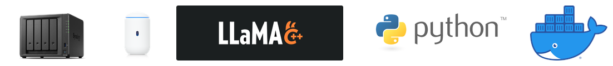

# How a 1991 Protocol Guards My Privately Hosted LLM

_I built a reverse proxy that reuses my existing RADIUS auth to guard self-hosted LLM and other web services_

---

## The Setup

My home office contains a mix of servers running different services, and I wanted to access my llama-server (part of llama.cpp) instance while traveling, the current setup:

- **UniFi UDM**: Router/gateway with integrated WiFi access points
- **Synology NAS**: Central server running RADIUS, file storage, calendar, contacts, and Docker containers
- **WiFi Authentication**: WPA Enterprise uses RADIUS server running on Synology
- **Synology Reverse Proxy**: Handles SSL/TLS termination but **no authentication**
- **llama-server**: Serves chat interface using open-source LLM

**The problem?** How to expose the llama-server securely but without yet another set of credentials. Could I leverage the existing RADIUS protocol for that?

And that's how this started—a simple desire to access my home AI without password proliferation.

### Technologies Used



## The Problem

I needed remote access to my llama-server instance. UniFi UDM only does port forwarding—not secure at all. Synology's reverse proxy terminates HTTPS but doesn't provide authentication. 

Synology already managed all my user accounts for file sharing and application access, and RADIUS Server allows leveraging that for WiFi authentication. This made it really tempting to find a solution that could also leverage RADIUS for web service authentication.


## Why RADIUS?

Frankly, because it's already available within my ecosystem and allows using the same set of users and groups I use day to day. 

RADIUS ([Remote Authentication Dial-In User Service](https://en.wikipedia.org/wiki/RADIUS)) was designed in 1991 for dial-up authentication. Despite its age, it's surprisingly well-suited for this use case:
1. **Already deployed** for UniFi WPA Enterprise WiFi
2. **Battle-tested** with decades of production use
3. **Centralized** authentication for all services
4. **Built into Synology** (Package Center)
5. **Simple protocol** compared to OAuth2/OIDC/SAML
6. **Single credential set** for both network and application access

So the path was clear: build a reverse proxy with RADIUS authentication.

## Building the Solution

### The MVP

I started with an all-in-one solution using the FastAPI framework. The authentication flow was straightforward:
1. Check if request has valid JWT cookie → Allow
2. No cookie? → Redirect to `/login`
3. Login form POSTs credentials → RADIUS authentication via [pyrad](https://github.com/pyradius/pyrad)
4. Success? → Set JWT cookie with expiry, redirect to original URL
5. Failure? → Display error

FastAPI provided async/await for handling concurrent requests. The `pyrad` library handled RADIUS client operations. The main challenge was understanding RADIUS packet structure (UDP-based with retry logic) and implementing packet signatures to prevent [Blast-RADIUS](https://www.bleepingcomputer.com/news/security/blastradius-attack-breaks-30-year-old-radius-authentication-protocol/) attacks.

### Real-World Challenges

#### Path Stripping

Many applications expect to be served from root (`/`) but need to be deployed at a subpath. Example:

```
User visits:   https://api.example.com/v1/users
Match rule:    api.example.com/v1 (with strip_path)
Backend sees:  /users
```

This required careful URL parsing and header rewriting (`X-Forwarded-*`) to work correctly with diverse application frameworks.

But at the end of the day, many apps and SPAs don't play nicely when hosted at a subpath. Going forward, I opted to use subdomains via DNS and route requests based on the domain instead.

#### Admin UI

I wanted dynamic, live configuration that wouldn't require manually editing JSON files or restarting the service. So I built a compact UI with Jinja2 templates:
- View all service mappings
- Add/edit/delete mappings
- Reorder mappings (order matters for matching)
- Enable/disable services
- No build step or npm dependencies

## The Solution (and Two Bonus Tools)

What started as one tool evolved into several solutions: an all-in-one and plugins for popular existing proxy servers.

### 1. **RevProxAuth** - The All-in-One Solution

**Authentication Flow:**
- WiFi devices connect via WPA Enterprise → RADIUS authentication
- Web requests go through Synology Reverse Proxy → RevProxAuth → RADIUS authentication
- Authenticated traffic proxied to llama-server or other services

### Detailed Network Diagram


RevProxAuth is the all-in-one option: 
- Compact Python/FastAPI application—easy to follow, easy to modify
- Acts as a full reverse proxy with RADIUS authentication
- Web UI for managing service mappings and basic metrics dashboard
- Path prefix stripping capability
- Special handling for LLM token streaming for improved responsiveness


### 2. **radius-auth-py** - Python Alternative

After building RevProxAuth, I realized many people already run reverse proxies like Nginx, Caddy, or Traefik. They don't need another full proxy—just the authentication piece. 

This led to a minimal Go service that could integrate as middleware:
- Easier to customize and modify
- Full Python ecosystem available
- `auth_request` protocol for Nginx
- ~10MB footprint

I initially extracted this from RevProxAuth as a proof of concept, then ported it to Go for the performance gains.


### 3. **radius-auth-go** - Lightweight Auth Middleware
Looking at how compact Caddy/Traefik containers are, I've decided to port radius-auth-py to Go and results to do not disappoint

- Runs on ~2MB of RAM
- Millisecond startup time

## The Results

My llama-server is now accessible remotely with the same credentials I use for everything else. No VPN needed, no password proliferation, just the existing RADIUS infrastructure.

**Key benefits:**
- Single credential set for network and application access
- Centralized user management via Synology
- Simple service addition (single mapping entry)
- Authentication layer for previously unprotected services
- Remote access without VPN complexity

## Lessons Learned

**The irony:** None of this would be necessary if Synology's Reverse Proxy provided authentication like it does for its own apps. But that limitation sparked a solution that ended up being more flexible and reusable.

## What's Next

**Short term:** / **Medium term:** / **Long term:**
- It just works - I can get back to agent development and testing. 

---

## Try It Yourself

- **GitHub:** [github.com/okigan/revproxauth](https://github.com/okigan/revproxauth)
- **Docker Hub:** 
  - `okigan/revproxauth:latest`
  - `okigan/radius-auth-go:latest`
  - `okigan/radius-auth-py:latest`
- **License:** MIT (use it, break it, fix it, share it)

---

*Igor Okulist*  
*October 2025*
